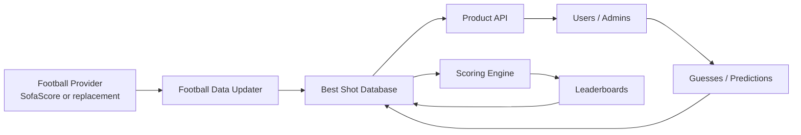
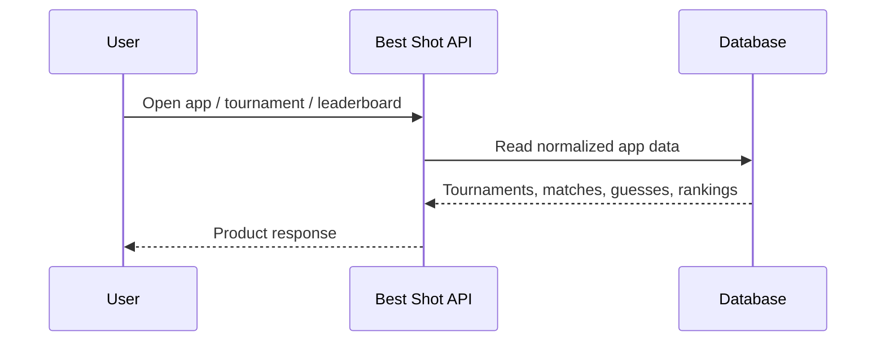
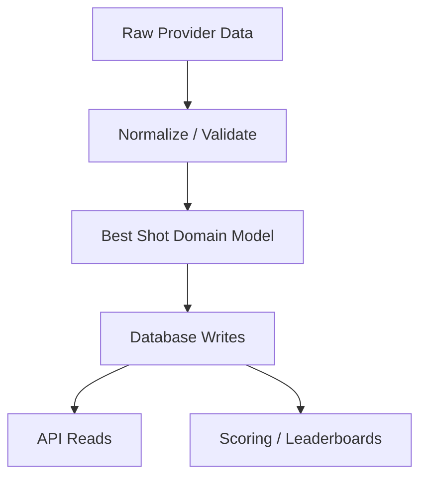
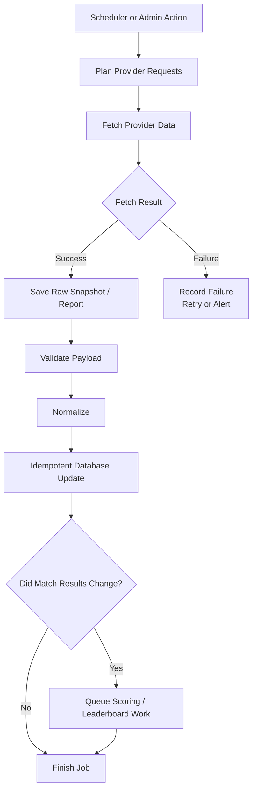
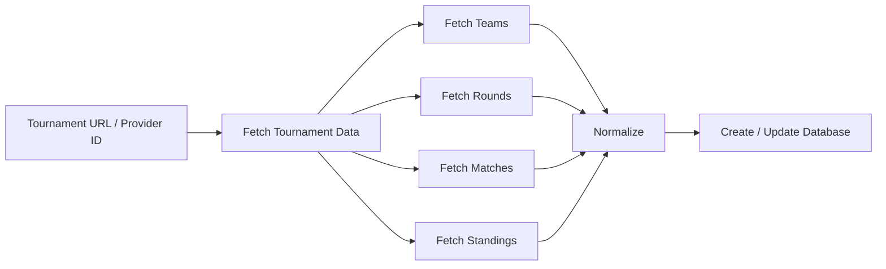
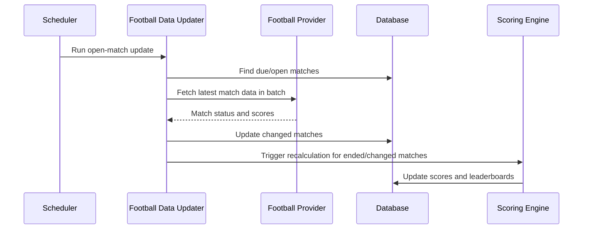
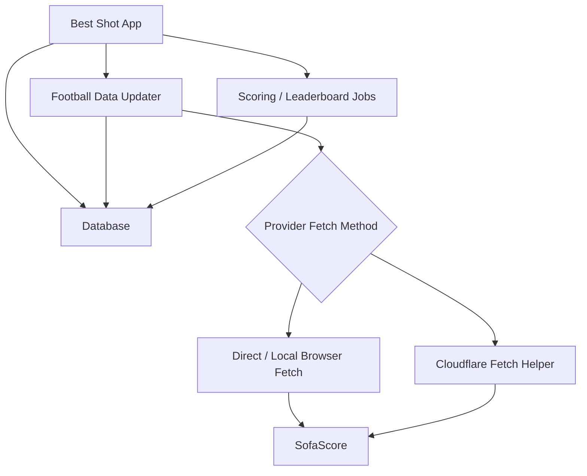
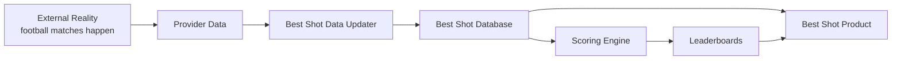

# Best Shot Project Handoff

## One-Sentence Summary

Best Shot is a football prediction app: users make guesses about real matches, the app keeps football data updated from an external provider, and then calculates scores and leaderboards from real match outcomes.

## What The App Does

The app has three core responsibilities:

```text
1. Serve product data to users
2. Keep football data up to date
3. Calculate scores and leaderboards
```

Everything else exists to support those three responsibilities.



## The Product In Plain English

Users need to see real football tournaments, teams, matches, standings, and match statuses. They make predictions around those matches. Once the real matches are played, the app uses the final results to calculate points and rank members.

The database is the source of truth for the product experience. User-facing requests should read from our database, not call SofaScore live.



## The Most Important Dependency

The app only works if football data is fresh enough.

Without external football data, the app cannot reliably know:

```text
- which tournaments exist
- which teams belong to them
- which matches exist
- when matches start
- whether matches are scheduled, live, postponed, or ended
- final scores
- standings
- current rounds
```

So the football data updater is not a side feature. It is part of the core product engine.

## The Three Planes Of The App

### 1. Product API

The Product API serves app data to users and admins.

It should be boring and reliable:

```text
request comes in
read database
apply authorization/business rules
return response
```

It should not scrape pages, launch browsers, or depend on SofaScore during normal user requests.

### 2. Football Data Updater

The Football Data Updater gets external football data and turns it into app data.

It has two main jobs:

```text
Initial assembly:
  build a tournament with teams, rounds, matches, and standings

Ongoing updates:
  keep matches, tournaments, teams, standings, and live status fresh
```

It should be observable, retryable, and easy to reason about.

### 3. Async Scoring And Leaderboards

The scoring layer calculates derived app state.

Examples:

```text
- match prediction outcomes
- member points
- tournament rankings
- global/member leaderboards
- recalculations after corrected match data
```

This work does not need to happen inside user requests. It should run asynchronously after relevant data changes.

## Core Data Concepts

The app needs durable data for:

```text
- tournaments
- seasons / rounds
- teams
- matches
- standings
- users / members
- guesses / predictions
- scores
- leaderboards
- provider job history
- provider reports / raw responses
```

Provider data and app data are not the same thing.



The provider may call a team one thing today and another thing later. It may return extra fields, missing fields, or changed payload shapes. The app needs a stable internal model that does not leak provider quirks everywhere.

## Football Data Flow

The healthy ingestion flow is:

```text
plan what data is needed
fetch provider data
store/report raw result
validate response
normalize into app objects
write database idempotently
trigger downstream scoring if needed
record success/failure
```



## Tournament Assembly

Tournament assembly means taking an external tournament and creating enough local data for the app to use it.

It needs to gather:

```text
- tournament identity
- teams
- rounds
- scheduled matches
- standings
- optional assets such as team/tournament images
```



The important product outcome:

```text
After assembly, users/admins can see the tournament, teams, fixtures, and standings from our database.
```

## Live / Open Match Updates

This is the most time-sensitive workflow.

The app periodically checks matches that are live, recently started, or expected to have changed.



This workflow should optimize for:

```text
- reliability
- low duplicate work
- clear failure reports
- safe retries
- no browser launch per match
```

## Current Provider Access Problem

The app has relied on browser-based access to SofaScore because direct server-side HTTP can be blocked.

The observed production issue:

```text
local runs often work
production on Railway sometimes fails
failures are 403 / challenge responses
```

This means the hard problem is not only mapping data. The hard problem is reliably acquiring provider JSON in production.

## What We Learned From Cloudflare Tests

Cloudflare was tested as a possible provider-fetch helper.

What worked:

```text
- a Cloudflare Worker could launch a managed browser
- it could fetch a SofaScore tournament page
- it could fetch SofaScore JSON
- for one tested standings endpoint, direct JSON worked without page warmup
```

What did not scale in the first shape:

```text
- one browser launch per URL/request is not production-friendly
- free Cloudflare limits are tight
- production would require batching and/or paid limits
```

The useful conclusion:

```text
Cloudflare may be a good fetch adapter.
Cloudflare should not become the brain of the app.
```

## Recommended Architecture Direction

Keep the app simple.

```text
One main app
One database
One football data updater
One async scoring path
Optional small Cloudflare fetch helper
```



Cloudflare, if used, should answer only one question:

```text
Given these SofaScore URLs, can you return JSON results?
```

The main app should still own:

```text
- which data to fetch
- when to fetch it
- how to normalize it
- how to write it
- how to report failures
- when to calculate scores
```

## What To Avoid

Avoid turning this into a distributed platform too early.

Do not start with:

```text
- many services
- generic workflow engines
- queues everywhere
- Cloudflare writing directly to the database
- browser-session coordination before batch fetching is proven
- AI scraping as the primary data source
```

Start small and prove each step.

## Practical Next Step

The best next engineering step is to simplify around one workflow:

```text
open-match updates
```

Why this one:

```text
- it runs frequently
- it exposes provider reliability problems quickly
- it directly affects scoring and leaderboards
- it forces the right batching behavior
```

A good first implementation should:

```text
1. find due/open matches
2. build provider URLs
3. fetch all needed URLs in one batch
4. classify success, challenge, rate limit, missing data, and provider errors
5. update changed matches
6. trigger scoring when match results change
7. write one clear report
```

## Engineering North Star

The app should become easier to operate and easier to understand.

```text
Product API:
  boring, fast, database-backed

Football Data Updater:
  small, observable, retryable, provider-aware

Provider Fetching:
  isolated behind one client/adapter

Scoring:
  async, deterministic, rerunnable

Failures:
  visible, classified, and actionable
```

## Final Mental Model



The project succeeds when this loop is reliable:

```text
real football changes
provider data is fetched
database is updated
guesses are scored
leaderboards are refreshed
users see trustworthy results
```

