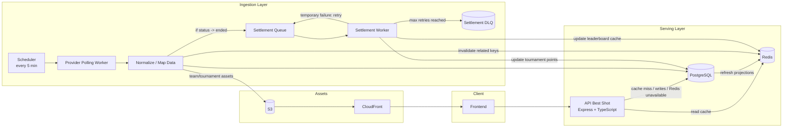
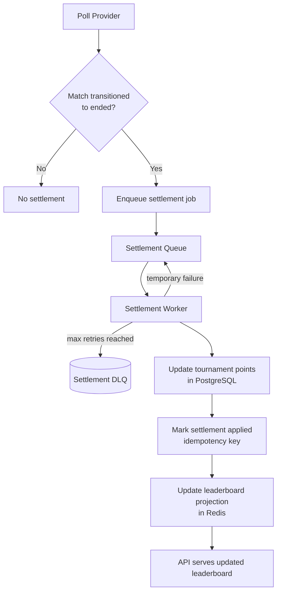

# System Design V1 (Draft)

This is our working draft for the app system design.
It is intentionally simple so we can iterate quickly.

## 1. Scope (V1)

- Member auth and profile
- Tournament, matches, guesses
- Tournament leaderboard
- Data provider ingestion
- Asset delivery (S3 + CloudFront)

## 2. Fixed Decisions

- PostgreSQL is the source of truth.
- Redis is a fast projection/cache.
- Leaderboard updates only when match status transitions to `ended` (provider `finished` maps to internal `ended`).
- We group settlement only for matches with the exact same `finished_at`.
- Dense ranking (`1, 1, 2`) for ties.
- Provider is polled every 5 minutes.
- Round identifier is `roundSlug` across API, cache keys, jobs, and internal flows.
- Ranking is computed in API from sorted points (dense ranking), not precomputed in DB.

## 3. High-Level Architecture



### 3.1 Redis Caches Used In V1

- `tournament:{id}:round:{slug}:matches`
- `tournament:{id}:standings`
- `tournament:{id}:leaderboard`
- Optional combined page cache:
  - `tournament:{id}:round:{slug}:page` (matches + standings)

### 3.2 Cache Behavior (Simple)

- API tries Redis first for reads.
- On miss, API reads PostgreSQL and repopulates Redis.
- If Redis is unavailable, API reads directly from PostgreSQL.
- Data-provider updates invalidate only affected keys.
- Finished-match settlements are enqueued before processing.
- Settlement worker retries temporary failures.
- Jobs that keep failing are moved to DLQ for manual/async handling.
- Settlement updates leaderboard projection right after finished matches are processed.

### 3.3 Cache Ownership (V1)

- Ingestion mapper owns invalidation for:
  - `tournament:{id}:round:{slug}:matches`
  - `tournament:{id}:standings`
- Settlement worker owns update/refresh for:
  - `tournament:{id}:leaderboard`

## 4. Finished Match Settlement Flow



## 5. Ranking Rules (V1)

- Sort by points descending.
- If points are equal, use dense ranking.
- Stable tiebreak display order: nickname ascending (or memberId if needed).

## 6. Decisions (V1)

| Decision | V1 Choice | Notes |
|---|---|---|
| Retry + DLQ policy | `3` attempts with backoff `30s`, `60s`, `120s`; then move to DLQ | Prevents infinite retry loops while still handling transient failures |
| Redis rebuild strategy | Read-through fallback to PostgreSQL; rebuild leaderboard projections using `hydrate:scoreboard` per tournament (or all active tournaments) | Keeps recovery scoped and safe |
| Leaderboard API contract | Use the response shape defined in section `7.4` with dense ranking metadata | Keeps frontend integration stable and explicit |

## 7. Contracts (V1)

This section defines the minimum contracts needed to implement the design safely.

### 7.1 Settlement Job Contract (`match_finished`)

Used by ingestion to trigger score settlement only when a match transitions to internal `ended`.
Provider status `finished` is normalized to internal status `ended` before job creation.

| Field | Type | Required | Notes |
|---|---|---|---|
| `eventType` | string | yes | Fixed value: `match_finished` |
| `matchId` | string (uuid) | yes | Internal match id |
| `tournamentId` | string (uuid) | yes | Internal tournament id |
| `finishedAt` | string (ISO datetime) | yes | Canonical match end timestamp used for grouping/idempotency |
| `provider` | string | yes | Example: `sofascore` |
| `providerStatus` | string | yes | Raw provider status (example: `finished`) |
| `internalStatus` | string | yes | Normalized internal status (must be `ended`) |
| `detectedAt` | string (ISO datetime) | yes | When poller detected the transition |
| `sourceVersion` | string | no | Optional provider-side version/hash if available |

Example:

```json
{
  "eventType": "match_finished",
  "matchId": "58de2f1b-1374-4c92-bd53-23a81943de4b",
  "tournamentId": "72ae0b2f-1967-49dd-a1d3-3b4965954fd8",
  "finishedAt": "2026-02-14T17:00:00Z",
  "provider": "sofascore",
  "providerStatus": "finished",
  "internalStatus": "ended",
  "detectedAt": "2026-02-14T17:05:03Z",
  "sourceVersion": "evt-884213"
}
```

### 7.2 Idempotency Contract

Settlement must never double-apply points.

- Idempotency key format: `matchId#finishedAt`
- Key example: `58de2f1b-1374-4c92-bd53-23a81943de4b#2026-02-14T17:00:00Z`
- Worker behavior:
  1. If key already marked applied -> skip scoring and ack job.
  2. If key not applied -> run settlement transaction and mark key as applied.

### 7.3 Retry + DLQ Contract

- Retry attempts: `3`
- Backoff: `30s`, `60s`, `120s`
- Temporary failures (db timeout, redis timeout): retry
- Permanent failures (bad payload, missing required ids): move to DLQ
- After max retries: move to `Settlement DLQ`
- DLQ handling:
  - alert/monitoring event
  - operator can replay job after fix

### 7.4 API Read Contracts (Tournament Page)

These are the read contracts for pages using Redis acceleration.

#### `GET /api/v2/tournaments/:tournamentId/matches/:roundSlug`

Response shape:

```json
{
  "data": [
    {
      "id": "match-uuid",
      "date": "2026-02-14T17:00:00Z",
      "status": "open|ended|not-defined",
      "home": { "id": "team-uuid", "name": "Arsenal", "score": 2 },
      "away": { "id": "team-uuid", "name": "Chelsea", "score": 1 }
    }
  ]
}
```


#### `GET /api/v2/tournaments/:tournamentId/standings`

Response shape:

```json
{
  "data": [
    { "position": 1, "teamId": "team-uuid", "team": "Arsenal", "points": 50, "played": 23 }
  ]
}
```

#### `GET /api/v2/tournaments/:tournamentId/leaderboard`

Response shape:

```json
{
  "data": [
    { "rank": 1, "memberId": "member-uuid", "nickName": "Ana", "points": 23 }
  ],
  "meta": { "ranking": "dense" }
}
```

## 8. Failure Scenarios (V1)

These are the 5 core failure cases we expect and how V1 should behave.

| # | Scenario | Detection | Expected System Behavior | User Impact | Recovery |
|---|---|---|---|---|---|
| 1 | Provider unavailable during poll | Poll worker timeout/error | Poll fails, no settlement jobs created for that cycle, next 5-min poll retries naturally | Leaderboard/matches can be stale until next successful poll | Automatic on next poll cycle |
| 2 | Settlement worker temporarily down | Queue lag grows, no job consumption | Jobs remain in settlement queue, no data loss, worker resumes and drains queue | Leaderboard updates delayed | Restart worker and process backlog |
| 3 | DB timeout during settlement | Worker gets DB error while applying points | Job is retried with backoff (`30s/60s/120s`), idempotency prevents double-apply | Delay for affected match updates | Automatic retry; DLQ if persistent |
| 4 | Crash after DB update but before Redis update | Process crash/restart signal, missing projection update | Idempotency key already applied blocks re-scoring; projection update is retried/replayed to Redis | Temporary mismatch: DB fresh, Redis stale | Replay projection/settlement job safely |
| 5 | Redis unavailable (read or write path) | Redis connection errors | Read path falls back to PostgreSQL; write path retries, then DLQ/manual replay if needed | Slower API responses; possible temporary stale cache | Redis restore + replay failed projection updates |

### 8.1 DLQ Policy In Practice

- A job goes to DLQ only after max retries are exhausted.
- DLQ job must preserve original payload and error reason.
- Replay must be idempotent and safe.
