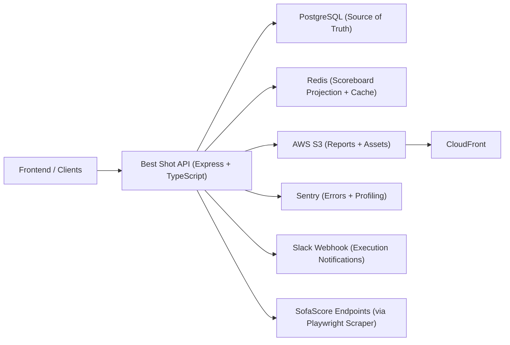
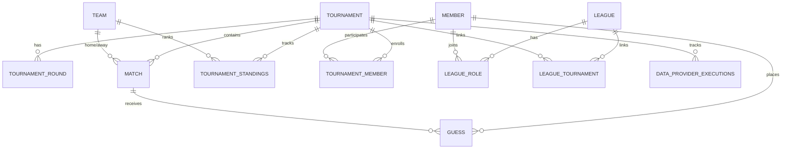
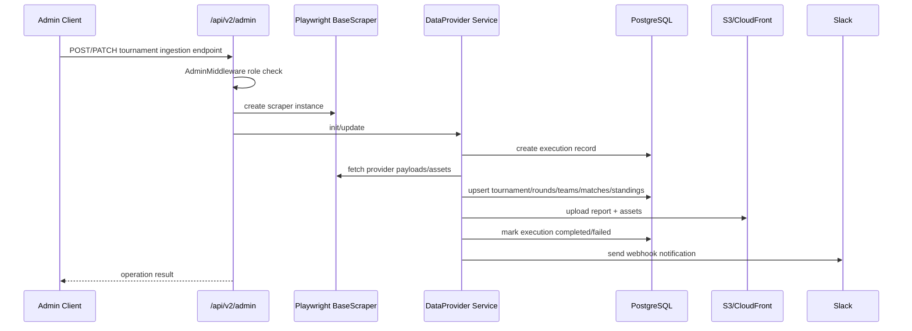

# System Design V1 (Draft)

## Document Status

- Version: `v1-draft`
- Last updated: `2026-02-16`
- Source of truth for this draft: current implementation in `src/`, `scripts/`, and `docs/architecture/`
- Goal: capture the real architecture as implemented today, then define next incremental design steps

## 1. Purpose and Scope

This system powers the Best Shot backend API for football predictions and league scoreboards.

In scope for this draft:

- Authenticated member APIs (tournaments, guesses, leagues, dashboard)
- Admin ingestion APIs (tournament bootstrap and update from data provider)
- Data layer (PostgreSQL + Drizzle)
- Scoreboard projection layer (Redis)
- Operational integrations (Playwright, S3/CloudFront, Slack, Sentry)

Out of scope for this draft:

- Frontend architecture
- Billing, rate limiting, and multi-region failover
- Full API contract catalog for every endpoint

## 2. System Context

## 3. Runtime Architecture

### 3.1 Application Entry and Middleware

- Entry point: `src/index.ts`
- Router root: `/api` mounted from `src/router/index.ts`
- Global middleware: `express.json()`, `cookie-parser`, `cors`, custom access-control headers, request logger
- Root endpoints: `GET /health`, `GET /`, `GET /debug/env` (debug endpoint still enabled)

### 3.2 API Versioning and Domains

Versioned domain routes are mounted under `/api/v1/...` and `/api/v2/...`.

Primary v2 areas:

- `/api/v2/auth`
- `/api/v2/member`
- `/api/v2/tournaments`
- `/api/v2/leagues`
- `/api/v2/guess`
- `/api/v2/dashboard`
- `/api/v2/ai`
- `/api/v2/admin`

### 3.3 Layering Pattern

The dominant pattern in the codebase is domain-driven layering:

- `api/` for HTTP orchestration
- `services/` for business logic
- `queries/` for database operations
- `schema/` for Drizzle table definitions

This pattern is consistent in core domains (`tournament`, `league`, `guess`, `match`, `member`, `data-provider`), with some legacy files coexisting in `admin/api`.

### 3.4 Security Boundaries

- Member auth: JWT in cookie (`MEMBER_PUBLIC_ID_COOKIE`) via `AuthMiddleware`
- Admin auth: `AdminMiddleware` resolves member role from DB and enforces `admin`
- Internal token middleware exists (`InternalMiddleware`) but is not currently wired to active routes

## 4. Data Architecture

### 4.1 Primary Data Store (PostgreSQL)

PostgreSQL is the persistent source of truth. Drizzle ORM manages schema and migrations.

Key entity tables:

- `member`
- `tournament`
- `tournament_round`
- `team`
- `match`
- `guess`
- `tournament_standings`
- `tournament_member`
- `league`
- `league_role`
- `league_tournament`
- `data_provider_executions`

### 4.2 Core Relational Model (Simplified)

### 4.3 Redis Projection and Cache

Redis is used for scoreboard projection and fast reads, with keys such as:

- `tournament:{tournamentId}:master_scores` (sorted set of member points)
- `league:{leagueId}:members` (set of league members)
- `league:{leagueId}:leaderboard` (league ranking projection)
- `league:{leagueId}:leaderboard:prev` (previous snapshot for movement)

Hydration utility:

- `scripts/hydrate-redis.ts` rebuilds projection from PostgreSQL (`tournament_member` and `league_role` links)

## 5. Core Flows

### 5.1 Authenticated Tournament Read Flow

1. Client calls `/api/v2/tournaments/:tournamentId/...` with auth cookie.
2. `AuthMiddleware` decodes JWT and sets `req.authenticatedUser`.
3. API calls service layer.
4. Services query Drizzle repositories.
5. Response returns domain DTOs (matches, guesses, score, standings, details).

### 5.2 Admin Ingestion Flow (Current)

Current control-plane characteristics:

- All ingestion work runs in request lifecycle (synchronous from HTTP perspective)
- Per-operation report JSON is always saved locally and optionally uploaded to S3
- `data_provider_executions` tracks status, summary, report URLs, and timings

### 5.3 Guess Scoring Flow (Per Request / Per Match)

- Guess analysis status machine: `NOT_STARTED`, `WAITING_FOR_GAME`, `EXPIRED`, `PAUSED`, `FINALIZED`
- Points model currently implemented: outcome correct = `3`, exact home score = `0`, exact away score = `0`

This scoring logic is used for:

- Member tournament score reads
- Match-level score delta calculation for scoreboard updates

### 5.4 League Scoreboard Flow (Current)

Implemented primitives in `ScoreboardService`:

- `calculateMatchPoints(matchId)`
- `applyScoreUpdates(tournamentId, deltas)`
- `refreshLeagueRanking(leagueId, tournamentId)`
- `getLeagueLeaderboard(...)`

Read path is active via `/api/v2/leagues/:leagueId/scoreboard`.

Write orchestration gap:

- There is no active settlement orchestrator/worker in `src/` that triggers `calculate/apply/refresh` automatically on match status transition.
- Manual utilities exist (`scripts/test-scoreboard-flow.ts`, hydration script).

## 6. Infrastructure and Deployment

- Runtime: Node.js `22.x`, TypeScript, Express
- DB: PostgreSQL (local docker compose + cloud connection options)
- Cache: Redis
- Scraping: Playwright (Chromium, headless)
- Storage/CDN: S3 + CloudFront
- Monitoring: Sentry + structured logger
- Container: multi-stage `Dockerfile` based on Playwright image

Local docker dependencies in `docker-compose.yml`:

- `postgres` on `5433:5432`
- `redis` on `6379:6379`

## 7. Reliability and Observability

Current strengths:

- Structured logging with domain tags
- Sentry integration enabled in `demo/staging/production`
- Retry utility with backoff exists (`30s`, `60s`, `120s`) and tests
- DB and Redis health checks at startup level

Current limitations:

- Ingestion jobs are synchronous and coupled to HTTP request success window
- No in-repo queue worker or scheduler implementation is currently present
- Minimal automated coverage for integration/business-critical flows (tests mostly unit/basic)
- `GET /debug/env` is exposed and should be gated/removed outside local environments

## 8. Known Design Gaps (To Address Next)

1. Settlement orchestration is incomplete: we still need event-driven transition handling when `match.status` changes to `ended`, plus idempotent persistence to avoid double scoring on replay/crash.
2. Async resilience is incomplete: queue-backed processing, retry policy, and DLQ are not wired for settlement flows.
3. Ranking semantics need formalization: desired dense ranking and tie-breaking rules are not codified, and current Redis rank reads are ordinal (`zrevrange` index), not dense.
4. Codebase consistency needs cleanup: legacy/unwired admin API files coexist with active service-based paths, and `data_provider_executions.status` naming is inconsistent across typing/comments (`started` vs `in_progress`).

## 9. Proposed V1 Increment Plan

1. Add `match_finished` event emission on status transition to `ended`.
2. Introduce settlement queue + worker.
3. Persist idempotency key `matchId#finishedAt`.
4. Execute DB update then Redis projection refresh with safe retry policy.
5. Add DLQ and replay tooling.
6. Add integration test covering replay/no-double-apply behavior.

## 10. Open Questions

1. Should `/api/v2/ai/predict/match/:matchId` be authenticated or public?
2. Should exact-score bonus points remain zero in v1 leaderboard logic?
3. Should we compute dense rank in Redis materialization or on API read?
4. Which runtime should own scheduler responsibilities (API process vs separate worker service)?

## 11. Cron Jobs and Queues (Proposed Model)

### 11.1 Three-Player Model

1. `Provider Executions` (`data_provider_executions`) = control-plane state and audit trail for a run.
2. `Cron Jobs` = time-based scheduler that decides when a run should start.
3. `Queues` = reliable work buffer/work distribution for async execution and retries.

### 11.2 Responsibilities

- Cron should enqueue work, not do scraping directly.
- Workers should execute scraping/settlement tasks and persist results.
- `data_provider_executions` should expose run status for UI/ops (`in_progress`, `completed`, `failed`).

### 11.3 Recommended Run Lifecycle

1. Cron fires for a tournament sync window.
2. API/worker creates an execution row with `requestId` and `status = in_progress`.
3. Producer enqueues jobs with `executionId` + `requestId` + payload.
4. Workers process jobs (provider fetch, map, DB upsert, optional cache refresh).
5. Queue handles retries with backoff for transient failures.
6. On max retries, job moves to DLQ and execution is marked `failed` (with error summary).
7. When all jobs for that execution complete, mark execution `completed` with duration and summary.

### 11.4 Queue Split for This System

1. `ingestion` queue: heavier data-provider operations (rounds, teams, matches, standings).
2. `settlement` queue: match-finished scoring and leaderboard projection updates.

This split prevents heavy Playwright jobs from delaying scoreboard settlement jobs.

### 11.5 Execution Row as Correlation Anchor

Use `requestId`/`executionId` in every queued message and worker log context so operations can be traced end-to-end:

- Scheduler log -> producer log -> worker log -> execution row -> report URL -> Slack notification.

### 11.6 Failure Handling Contract

- Retry transient errors (provider timeout, short DB contention, temporary Redis failure).
- Do not infinitely retry malformed payloads or permanent validation failures.
- Preserve original payload and final error in DLQ for replay.
- Replays must be idempotent for both DB updates and leaderboard projection updates.
