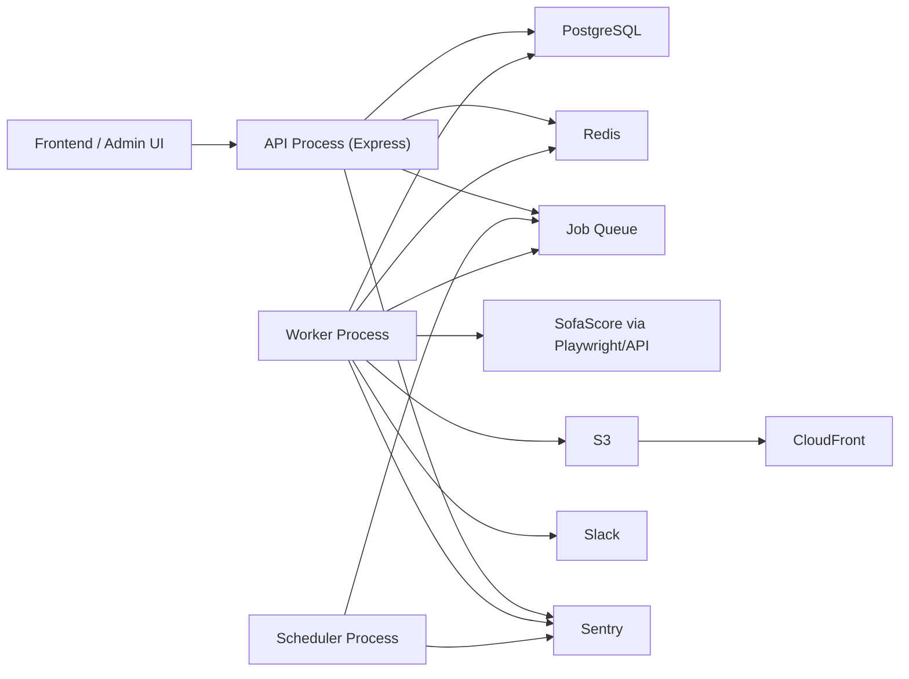
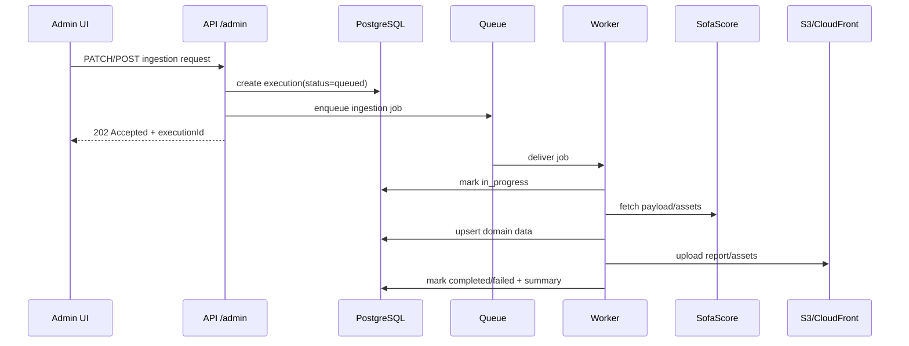
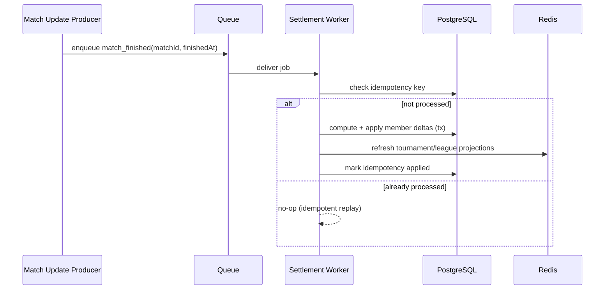

# System Design V2 (Current State + Target Architecture)

## Document Status

- Version: `v2`
- Last updated: `2026-02-18`
- Source of truth: current repository state in `src/`, `scripts/`, `docs/architecture/`, and CI workflows
- Scope: backend architecture for ingestion, scoring/leaderboards, member APIs, and operations
- Out of scope: frontend implementation details, billing, global multi-region failover

---

## 1. Executive Summary

This codebase already has strong building blocks:

- clear domain-oriented folder structure
- typed DB schemas with Drizzle
- admin ingestion pipeline with execution tracking + reports
- Redis integration and hydration utility
- CI quality gates and deploy workflows

But the current baseline has structural gaps that block reliability and delivery:

1. **Scoreboard domain was removed but still imported** by league API and scripts, so `yarn compile` fails.
2. **Ingestion is synchronous in HTTP request lifecycle** (Playwright + DB + assets + report + Slack in one request path).
3. **Scheduler/worker architecture is implied but not implemented** in `src/` (scripts mention scheduler, file does not exist).
4. **Status contracts are inconsistent** (`data_provider_executions.status` constants vs runtime values).
5. **Operational/security drift** exists (`/debug/env` exposed, healthcheck path drift in Dockerfile, duplicate auth checks in seed flow).

V2 defines a practical target:

- keep the monolith codebase, but split runtime into **API process + worker process + scheduler process**
- move heavy ingestion and settlement to **queue-backed async jobs**
- make scoring/leaderboard a first-class module again (or fully deprecate it with explicit API changes)
- harden idempotency, retries, DLQ, and observability contracts

---

## 2. As-Built Architecture (Today)

## 2.1 Runtime and Entry Points

- Entry: `src/index.ts`
- Router mount: `/api` via `src/router/index.ts`
- Middleware stack:
  - JSON body parsing
  - cookies
  - CORS
  - request logger
  - custom access-control headers
- Public root routes:
  - `GET /health`
  - `GET /`
  - `GET /debug/env` (currently active)

## 2.2 Domain Surface

Primary mounted routes:

- `/api/v2/admin`
- `/api/v2/ai`
- `/api/v2/auth`
- `/api/v2/dashboard`
- `/api/v2/guess`
- `/api/v2/leagues`
- `/api/v2/match`
- `/api/v2/member`
- `/api/v2/tournaments`

Both `v1` and `v2` are still present for most domains; many handlers are shared.

## 2.3 Data and Integrations

- PostgreSQL (source of truth)
- Redis (projection/cache)
- SofaScore (via Playwright scraping + direct event fetch)
- S3 + CloudFront (assets and operation reports)
- Slack webhooks (execution notifications)
- Sentry (enabled by environment)

## 2.4 Current Ingestion Flow

Admin ingestion endpoints instantiate Playwright directly and execute full workflows synchronously:

1. validate admin
2. create execution row (`data_provider_executions`)
3. fetch provider payloads/assets
4. upsert DB entities (tournament/rounds/teams/matches/standings)
5. upload report
6. update execution + notify Slack
7. return HTTP response

This is functional, but failure blast radius and request latency are high.

## 2.5 Current Scoring/Leaderboard State

- league API imports `ScoreboardService`
- scripts import `ScoreboardService`
- score domain files are currently deleted from the working tree
- compile currently fails because module is missing

This is the highest-priority architecture integrity issue.

---

## 3. Critical Findings (Ordered by Severity)

## 3.1 P0: Build Integrity Broken

`yarn compile` fails due missing `@/domains/score/services/scoreboard.service` imports from:

- `src/domains/league/api/index.ts`
- `scripts/test-scoreboard-flow.ts`

Impact:

- CI/deploy quality gates that run compile will fail.
- scoreboard endpoint path is structurally undefined.

## 3.2 P1: Control-Plane Contract Drift

`data_provider_executions.status` constants are defined as:

- `started`
- `completed`
- `failed`

while runtime writes:

- `in_progress`
- `completed`
- `failed`

Impact:

- status semantics are ambiguous.
- downstream dashboards/filters become brittle.
- DB/typing mismatch risk increases as migrations evolve.

## 3.3 P1: Synchronous Heavy Jobs in API Path

Playwright-heavy scraping, asset upload, and reporting run inline with admin API request lifecycle.

Impact:

- request timeouts and retries can duplicate work
- harder to recover partially completed runs
- poor operational isolation (API responsiveness tied to scraping latency)

## 3.4 P1: Security and Ops Exposure

- `/debug/env` route is active.
- Dockerfile healthcheck targets `/api/v1/admin/health` while active admin health route is `/api/v2/admin/health`.
- seed endpoint performs extra token handling in-route despite `AdminMiddleware`.

Impact:

- avoidable security surface
- misleading health status in platform checks
- auth behavior complexity and drift

## 3.5 P2: Scheduler and Worker Drift

Package scripts reference scheduler paths not present in `src/` (`src/scheduler/cron-jobs.ts`).

Impact:

- intended architecture is undocumented/absent in runtime
- automation promises are not executable from main code path

## 3.6 P2: Observability Consistency Gaps

There is good structured logging infrastructure, but many paths still use raw `console.log`/`console.error` with inconsistent context keys.

Impact:

- weaker traceability across request -> execution -> job
- harder to build reliable operations dashboards

---

## 4. Architecture Principles for V2

1. **Single source of truth first**: Postgres state transitions are authoritative; Redis is projection.
2. **Async by default for heavy work**: API enqueues; workers execute.
3. **Idempotency before retries**: every replay-safe action has a deterministic key.
4. **Control plane explicitness**: execution/job status model is standardized and queryable.
5. **Process isolation, not repo split**: keep monorepo monolith, split runtime roles.
6. **Observability as contract**: correlation IDs and status transitions are part of the design.

---

## 5. Target Runtime Topology (V2)

## 5.1 Runtime Roles

- **API process**
  - auth and validation
  - read APIs
  - command intake (enqueue jobs + execution tracking)
  - lightweight sync operations only

- **Worker process**
  - ingestion jobs
  - settlement jobs
  - retries + idempotency enforcement
  - report generation and notifications

- **Scheduler process**
  - time-based triggers
  - creates execution records and enqueues jobs
  - no scraping or heavy DB mutations directly

---

## 6. Domain Architecture (Proposed Boundaries)

## 6.1 Keep Existing Core Domains

- `auth`
- `member`
- `tournament`
- `tournament-round`
- `match`
- `guess`
- `league`
- `data-provider`

## 6.2 Introduce/Restore Operational Domains

- `jobs` (queue abstraction, producers, consumers, retry policy)
- `settlement` (score delta computation, idempotent application, projection refresh)
- `scoreboard` (read model for league/tournament rankings and pagination)

If the old `score` domain is intentionally removed, replace references immediately and create a canonical `settlement` + `scoreboard` module with explicit migration notes.

---

## 7. Data and State Contracts (V2)

## 7.1 Execution State Machine

Standardize execution states to:

- `queued`
- `in_progress`
- `completed`
- `failed`
- `cancelled` (optional but recommended)

Recommended addition:

- `execution_steps` table (or JSON step log) for fine-grained progress per execution.

## 7.2 Job Payload Contract

Minimal required fields for all jobs:

- `jobId` (queue-level unique ID)
- `executionId`
- `requestId`
- `jobType`
- `entityId` (tournamentId/matchId/etc)
- `attempt`
- `enqueuedAt`

## 7.3 Idempotency Contract

Settlement jobs need deterministic idempotency key:

- `settlement:{matchId}:{matchStatusTimestamp}`

Ingestion jobs need operation key:

- `ingestion:{operationType}:{tournamentId}:{providerSnapshotVersionOrTimestamp}`

Persist idempotency outcome:

- key
- first_applied_at
- execution_id
- checksum/hash of effect
- status

## 7.4 Projection Contract (Redis)

Redis keys remain projection-only:

- `tournament:{id}:master_scores` (sorted set)
- `league:{id}:members` (set)
- `league:{id}:leaderboard` (sorted set or materialized list)

Rules:

1. DB write succeeds before projection update.
2. Projection rebuild is replayable from DB.
3. Reads can fallback to DB for degraded-mode response.

---

## 8. Flow Designs

## 8.1 Admin Ingestion Command Flow

## 8.2 Match Settlement Flow

## 8.3 Read Scoreboard Flow

1. API validates league membership.
2. API queries Redis projection for rank page.
3. If projection missing/stale, trigger lazy rebuild strategy (bounded) or fallback to DB.
4. Return ranking with deterministic ordering and tie semantics.

---

## 9. Technology Choices and Tradeoffs

## 9.1 Queue Layer

Recommended default: **BullMQ (Redis-backed)** because Redis already exists.

Pros:

- low operational overhead in current stack
- delayed jobs + retries + DLQ patterns are straightforward
- local/dev parity is easy

Tradeoff:

- if long-term scale requires stronger durability semantics, move to managed queue (e.g., SQS) later behind an internal queue abstraction.

## 9.2 Process Model

Keep one repo, run three process types:

- `api`
- `worker`
- `scheduler`

Pros:

- clean fault isolation
- preserves current team velocity and code ownership
- no early microservice tax

---

## 10. Security and Compliance Hardening

1. Remove or strictly gate `/debug/env` to local-only mode.
2. Ensure internal-only endpoints use `InternalMiddleware` explicitly where intended.
3. Simplify seed auth flow: rely on middleware + environment gate, remove duplicate token logic.
4. Standardize cookie security by environment (secure/sameSite rules and trusted proxy).
5. Add audit log metadata for admin ingestion commands (who triggered what, when).

---

## 11. Reliability, SLOs, and Operational Metrics

## 11.1 Suggested Initial SLOs

- API availability: `99.9%`
- P95 member read endpoints: `< 300ms`
- Ingestion command acknowledgment (202): `< 500ms`
- Settlement lag (match ended -> points available): `< 5 minutes` for 99th percentile

## 11.2 Golden Signals and KPIs

- queue depth by job type
- retry count and DLQ count
- execution completion rate and duration percentiles
- settlement idempotency no-op rate
- scoreboard staleness age

## 11.3 Logging Contract

Every log in API/worker/scheduler should include:

- `requestId`
- `executionId` (when applicable)
- `jobId` (worker context)
- `domain`
- `operation`
- `component`

---

## 12. Testing Strategy (Architecture-Level)

## 12.1 Required Test Layers

1. **Unit**: pure scoring and mapping functions.
2. **Integration**: DB + Redis for settlement apply and projection refresh.
3. **Workflow**: queue consumer replay/idempotency and retry-to-DLQ behavior.
4. **Contract**: status model transitions in `data_provider_executions`.

## 12.2 High-Value Test Cases

1. `open -> ended` emits settlement once and applies points once.
2. replay same settlement event does not double-apply.
3. partial failure between DB and Redis is recoverable.
4. ingestion report is persisted on both success and failure.
5. scoreboard endpoint returns deterministic rank ordering on ties.

---

## 13. Migration Plan (No Deadline, Quality-First)

## Phase 0: Stabilize Baseline

1. Resolve score domain compile break (restore module or remove endpoint/scripts with explicit deprecation).
2. Align `data_provider_executions.status` semantics and typing.
3. Fix Dockerfile healthcheck path to active route.
4. Gate/remove `/debug/env` outside local dev.

Exit criteria:

- `yarn compile` green
- deploy workflows can pass compile step
- status contract documented and consistent

## Phase 1: Introduce Queue Infrastructure

1. Add `jobs` module with abstraction + BullMQ implementation.
2. Create worker entrypoint and scheduler entrypoint.
3. Add DLQ and retry policies by job type.
4. Add correlation IDs to producers/consumers/logs.

Exit criteria:

- ingestion commands can enqueue and be consumed in non-prod
- retry + DLQ visible in metrics/logs

## Phase 2: Move Ingestion Off Request Path

1. Convert admin ingestion endpoints to command/202 pattern.
2. Worker executes all scraping/upsert/report operations.
3. API execution endpoints become source of run status.

Exit criteria:

- admin ingestion requests return quickly
- long-running work does not block API threads

## Phase 3: Settlement and Scoreboard Hardening

1. Implement settlement worker with idempotency persistence.
2. Implement/restore scoreboard read model as explicit domain.
3. Add projection rebuild/recovery jobs.

Exit criteria:

- deterministic replay-safe settlement
- scoreboard endpoints backed by clear architecture contracts

## Phase 4: Operational Excellence

1. SLO dashboards and alerts.
2. Runbooks for failed executions, DLQ replay, projection rebuild.
3. Security cleanup and route exposure audit.

---

## 14. Open Design Decisions

1. Should `/api/v2/ai/predict/match/:matchId` require auth?
2. Keep exact-score bonus at `0` or make scoring configurable per tournament/league?
3. Ranking semantics:
   - dense rank
   - tie-breaker policy (guess accuracy, recent form, deterministic member ID order, etc)
4. Queue backend:
   - BullMQ now, abstraction for SQS later
5. Projection strategy:
   - strong cache-first with fallback
   - or explicit materialized view in Postgres for scoreboard reads

---

## 15. Immediate Next Actions (Mentor Recommendation)

1. Close P0 first: make build green by resolving scoreboard module contract.
2. Lock status contract for executions before adding any queue workers.
3. Implement queue + worker skeleton without changing business logic yet.
4. Move one ingestion path (`update matches by round`) to async as pilot.
5. Add settlement idempotency table + replay test before broad rollout.

This sequence minimizes risk while producing measurable reliability gains.

