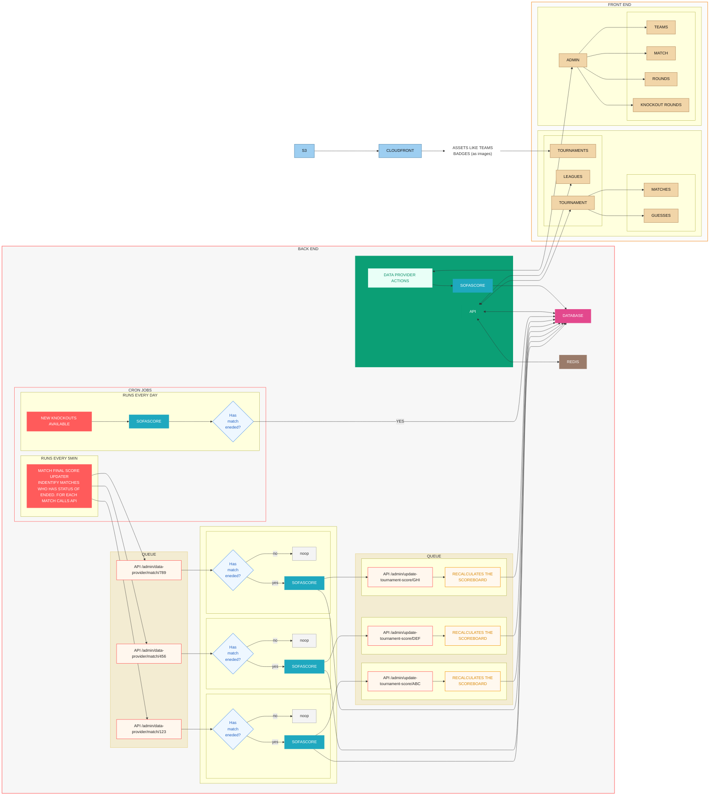

# Whiteboard Clone (Mermaid)

This is a high-fidelity redraw of the shared whiteboard using Mermaid, preserving labels, flow intent, and color coding as closely as Mermaid allows.

```mermaid
flowchart LR
  %% =========================
  %% BACKEND (left + center)
  %% =========================
  subgraph BE["BACK END"]
    direction LR

    subgraph PIPE[" "]
      direction TB

      subgraph CRON["CRON JOBS"]
        direction LR
        subgraph C5["RUNS EVERY 5MIN"]
          direction TB
          CRON5["MATCH FINAL SCORE UPDATER<br/>INDENTIFY MATCHES WHO HAS STATUS OF ENDED. FOR EACH MATCH CALLS API"]
        end

        subgraph C1D["RUNS EVERY DAY"]
          direction TB
          KNOCK["NEW KNOCKOUTS AVAILABLE"] --> SF_DAY["SOFASCORE"] --> D_DAY{"Has<br/>match<br/>eneded?"}
        end
      end

      subgraph Q1["QUEUE"]
        direction LR
        Q1A["API /admin/data-provider/match/123"]
        Q1B["API /admin/data-provider/match/456"]
        Q1C["API /admin/data-provider/match/789"]
      end

      subgraph DEC[" "]
        direction LR
        subgraph L1[" "]
          direction TB
          D1{"Has<br/>match<br/>eneded?"}
          N1["noop"]
          SF1["SOFASCORE"]
        end
        subgraph L2[" "]
          direction TB
          D2{"Has<br/>match<br/>eneded?"}
          N2["noop"]
          SF2["SOFASCORE"]
        end
        subgraph L3[" "]
          direction TB
          D3{"Has<br/>match<br/>eneded?"}
          N3["noop"]
          SF3["SOFASCORE"]
        end
      end

      subgraph Q2["QUEUE"]
        direction LR
        subgraph U1L[" "]
          direction TB
          U1["API /admin/update-tournament-score/ABC"]
          R1["RECALCULATES THE<br/>SCOREBOARD"]
        end
        subgraph U2L[" "]
          direction TB
          U2["API /admin/update-tournament-score/DEF"]
          R2["RECALCULATES THE<br/>SCOREBOARD"]
        end
        subgraph U3L[" "]
          direction TB
          U3["API /admin/update-tournament-score/GHI"]
          R3["RECALCULATES THE<br/>SCOREBOARD"]
        end
      end
    end

    subgraph CORE[" "]
      direction TB
      DB["DATABASE"]
      REDIS["REDIS"]

      subgraph APIBOX[" "]
        direction TB
        API_TOP["API"]
        API_DPA["DATA PROVIDER ACTIONS"]
        SF_API["SOFASCORE"]
      end
    end
  end

  %% =========================
  %% FRONTEND (right)
  %% =========================
  subgraph FE["FRONT END"]
    direction TB

    subgraph FE_TOP[" "]
      direction LR
      subgraph FE_LEFT[" "]
        direction TB
        FE_TOURNAMENTS["TOURNAMENTS"]
        FE_LEAGUES["LEAGUES"]
        FE_TOURNAMENT["TOURNAMENT"]
      end

      subgraph FE_RIGHT[" "]
        direction TB
        FE_MATCHES["MATCHES"]
        FE_GUESSES["GUESSES"]
      end
    end

    subgraph FE_ADMIN_ROW[" "]
      direction LR
      FE_ADMIN["ADMIN"]

      subgraph FE_ADMIN_RIGHT[" "]
        direction TB
        FE_TEAMS["TEAMS"]
        FE_MATCH["MATCH"]
        FE_ROUNDS["ROUNDS"]
        FE_KNOCKOUT["KNOCKOUT ROUNDS"]
      end
    end
  end

  %% =========================
  %% CDN / assets (top-right)
  %% =========================
  S3["S3"] --> CF["CLOUDFRONT"] --> ASSETS["ASSETS LIKE TEAMS<br/>BADGES (as images)"] --> FE_TOURNAMENTS

  %% =========================
  %% Main flow wiring
  %% =========================
  CRON5 --> Q1A
  CRON5 --> Q1B
  CRON5 --> Q1C

  Q1A --> D1
  Q1B --> D2
  Q1C --> D3

  D1 -- "no" --> N1
  D2 -- "no" --> N2
  D3 -- "no" --> N3

  D1 -- "yes" --> SF1
  D2 -- "yes" --> SF2
  D3 -- "yes" --> SF3

  SF1 --> DB
  SF2 --> DB
  SF3 --> DB

  SF1 --> U1
  SF2 --> U2
  SF3 --> U3

  U1 --> R1 --> DB
  U2 --> R2 --> DB
  U3 --> R3 --> DB

  D_DAY -- "YES" --> DB

  API_TOP <--> DB
  API_TOP <--> REDIS
  API_DPA --> SF_API --> DB

  API_TOP <--> FE_TOURNAMENT
  API_TOP <--> FE_LEAGUES
  API_DPA <--> FE_ADMIN

  FE_TOURNAMENT --> FE_MATCHES
  FE_TOURNAMENT --> FE_GUESSES

  FE_ADMIN --> FE_TEAMS
  FE_ADMIN --> FE_MATCH
  FE_ADMIN --> FE_ROUNDS
  FE_ADMIN --> FE_KNOCKOUT

  %% =========================
  %% Styling
  %% =========================
  classDef cronAction fill:#ff5b5b,stroke:#ff5b5b,color:#fff,stroke-width:1px;
  classDef queueApi fill:#fff7ee,stroke:#ff5b5b,color:#222,stroke-width:1.5px;
  classDef decision fill:#eef7ff,stroke:#2f80ed,color:#1f5fbf,stroke-width:1.5px;
  classDef sofa fill:#1fa8bf,stroke:#1fa8bf,color:#fff,stroke-width:1px;
  classDef noop fill:#f4f4f4,stroke:#999,color:#333,stroke-width:1px;
  classDef db fill:#e3488d,stroke:#e3488d,color:#fff,stroke-width:2px;
  classDef redis fill:#9a7b6a,stroke:#9a7b6a,color:#fff,stroke-width:2px;
  classDef apiTop fill:#0b9f75,stroke:#0b9f75,color:#fff,stroke-width:2px;
  classDef apiSub fill:#e9fff7,stroke:#0b9f75,color:#0a8d67,stroke-width:1.5px;
  classDef feBox fill:#f1d5a8,stroke:#ba9365,color:#111,stroke-width:1.5px;
  classDef storage fill:#9dcef1,stroke:#5a8eb2,color:#111,stroke-width:1.5px;
  classDef note fill:transparent,stroke:transparent,color:#333,stroke-width:0px;
  classDef recalc fill:#fff8ef,stroke:#f39c12,color:#d78500,stroke-width:1.5px;

  class CRON5,KNOCK cronAction;
  class Q1A,Q1B,Q1C,U1,U2,U3 queueApi;
  class D1,D2,D3,D_DAY decision;
  class SF1,SF2,SF3,SF_DAY,SF_API sofa;
  class N1,N2,N3 noop;
  class DB db;
  class REDIS redis;
  class API_TOP apiTop;
  class API_DPA apiSub;
  class FE_TOURNAMENTS,FE_LEAGUES,FE_TOURNAMENT,FE_MATCHES,FE_GUESSES,FE_ADMIN,FE_TEAMS,FE_MATCH,FE_ROUNDS,FE_KNOCKOUT feBox;
  class S3,CF storage;
  class ASSETS note;
  class R1,R2,R3 recalc;

  style BE fill:#f7f7f7,stroke:#ff6b6b,stroke-width:2px
  style FE fill:#fbfbfb,stroke:#f5a24d,stroke-width:2px
  style CRON fill:#f7f7f7,stroke:#ff6b6b,stroke-width:1.5px
  style Q1 fill:#f3ecd2,stroke:#e6d38f,stroke-width:1.5px
  style Q2 fill:#f3ecd2,stroke:#e6d38f,stroke-width:1.5px
  style PIPE fill:transparent,stroke:transparent
  style CORE fill:transparent,stroke:transparent
  style APIBOX fill:#0b9f75,stroke:#0b9f75,stroke-width:2px
```
