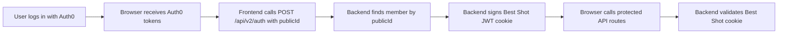
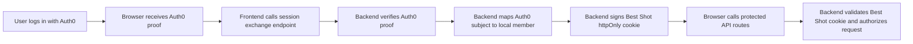

# Auth0 Session Flow Guide

This guide explains the current Best Shot authentication flow, the recommended secure flow, and how authentication, authorization, and database security fit together.

## Core Model

Keep this sentence in mind:

`Auth0 proves identity. Best Shot verifies that proof. Best Shot creates its own session. Best Shot authorizes access. The database adds defense in depth.`

## Current Flow

Today, the system appears to work like this:

1. The frontend starts Auth0 login using Authorization Code Flow with PKCE.
2. Auth0 authenticates the user and returns tokens to the browser.
3. The frontend calls `POST /api/v2/auth` with a plain `publicId`.
4. The backend looks up the member by `publicId`.
5. If the member exists, the backend signs its own JWT and sets the `member_public_id` cookie.
6. Later API requests send that cookie.
7. The backend validates its own JWT cookie and allows protected routes.

## Why The Current Flow Is Weak

The weak point is step 3.

`publicId` is an identifier, not proof.

That means the current flow answers:

- "Does this account exist?"

But it does not answer:

- "Did Auth0 prove that this caller is the owner of this account?"

So the problem is not "the user might not exist."

The problem is:

- if an attacker learns a valid `publicId`
- and the backend accepts only that `publicId`
- the backend can create a session for the attacker as that existing user

This is the sentence to remember:

`Checking that a user exists is not the same as checking that the caller is that user.`

## Recommended Flow For Best Shot

For this app, the best near-term shape is:

1. Keep Auth0 on the frontend.
2. Keep the backend-issued `httpOnly` session cookie.
3. Replace the plain `publicId` handoff with an Auth0 proof that the backend verifies.
4. Only after successful verification should the backend create the Best Shot session.

## What The Backend Should Verify

Before minting its own session, the backend should verify:

1. token signature
2. issuer (`iss`)
3. audience (`aud`)
4. expiration (`exp`)
5. subject (`sub`)

Optionally, depending on business rules:

1. `email_verified`
2. allowed connection/provider
3. any required org or tenant claims

## Which Auth0 Proof Fits Best

There are two practical options.

### Option A - Best Near-Term Fit

The frontend sends an Auth0 proof to a dedicated session exchange endpoint, and the backend verifies it before setting the Best Shot cookie.

For an API boundary, the preferred proof is an Auth0 access token intended for the Best Shot API audience.

Why this fits Best Shot:

- minimal change to the current frontend UX
- keeps backend-owned `httpOnly` sessions
- preserves the current cookie-based API model
- lets Best Shot stay the source of truth for local roles

### Option B - Best Long-Term Boundary

Move more of the login exchange to the backend so the backend handles the Auth0 callback or code exchange directly before issuing the Best Shot session.

Why teams choose this:

- strongest trust boundary
- fewer identity decisions made in the browser
- simpler mental model for server-owned sessions

Why it may be heavier right now:

- more frontend and backend auth plumbing
- deeper changes to current login flow

## Recommended Direction

For Best Shot, the recommended direction is:

1. keep the backend-issued `httpOnly` cookie
2. keep Best Shot authorization in backend code and the local database
3. change the Auth0-to-backend handoff so the backend verifies Auth0 proof before minting a session
4. consider a fuller backend-owned callback flow later if the team wants a stronger long-term boundary

## Responsibilities By Layer

### Frontend

The frontend should:

1. start Auth0 login
2. receive Auth0 proof
3. call the session exchange endpoint
4. avoid deciding local roles or trust levels
5. rely on the browser to send the Best Shot cookie on later requests

### Auth0

Auth0 should:

1. authenticate the human user
2. issue signed proof of identity
3. remain the external identity provider

### Backend

The backend should:

1. verify Auth0 proof
2. map the Auth0 subject to a local member
3. create the Best Shot session cookie
4. validate the Best Shot session cookie on later requests
5. enforce route and action authorization

### Database

The database should:

1. store the local member record
2. store Best Shot roles such as `admin` and `member`
3. remain the source of truth for authorization data
4. later add row-level protection where appropriate

## Authentication vs Authorization In Best Shot

Use this split:

- Authentication: "Who is this user?"  
  Auth0 answers this, and Best Shot verifies the proof.

- Session authentication: "Does this request have a valid Best Shot session?"  
  Best Shot answers this using its own cookie.

- Authorization: "What can this user do?"  
  Best Shot answers this using local data such as `member.role`, ownership, and league membership.

This means admin rights should come from the Best Shot database, not from the frontend.

## Admin Roles

The healthy model is:

1. Auth0 identifies the user
2. Best Shot maps that user to a local member row
3. Best Shot reads the local role
4. admin checks use the local role as the source of truth

That keeps external identity separate from internal permission decisions.

## How This Connects To Database Security And RLS

Authentication, authorization, and RLS protect different boundaries.

### Auth0 Verification

Protects the login handoff.

Goal:

- stop the backend from minting a local session based on an unverified identity claim

### Backend Authorization

Protects API routes and business actions.

Goal:

- ensure only allowed users can perform allowed actions

### RLS

Protects the database rows themselves.

Goal:

- ensure row access rules still exist even if the application layer is bypassed or makes a mistake

This is why fixing Auth0 login does not replace RLS, and adding RLS does not replace proper Auth0 verification.

They solve different problems.

## Best Shot Security Sequence

If we harden this system in stages, the order should be:

1. fix the Auth0-to-backend trust handoff
2. keep authorization decisions in backend code using local roles and ownership
3. review admin and internal-only routes
4. add RLS for sensitive tables as defense in depth

## Practical Rule Of Thumb

If the browser says:

`I am user X`

the backend should not trust that by itself.

If Auth0 says:

`I signed proof that this caller is user X`

the backend can verify that, then create its own session.
