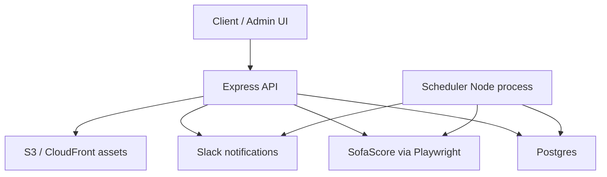
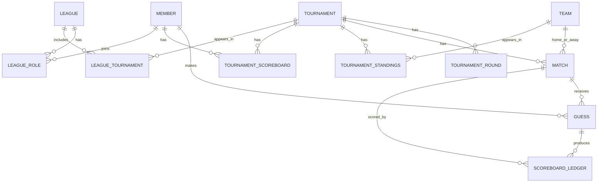
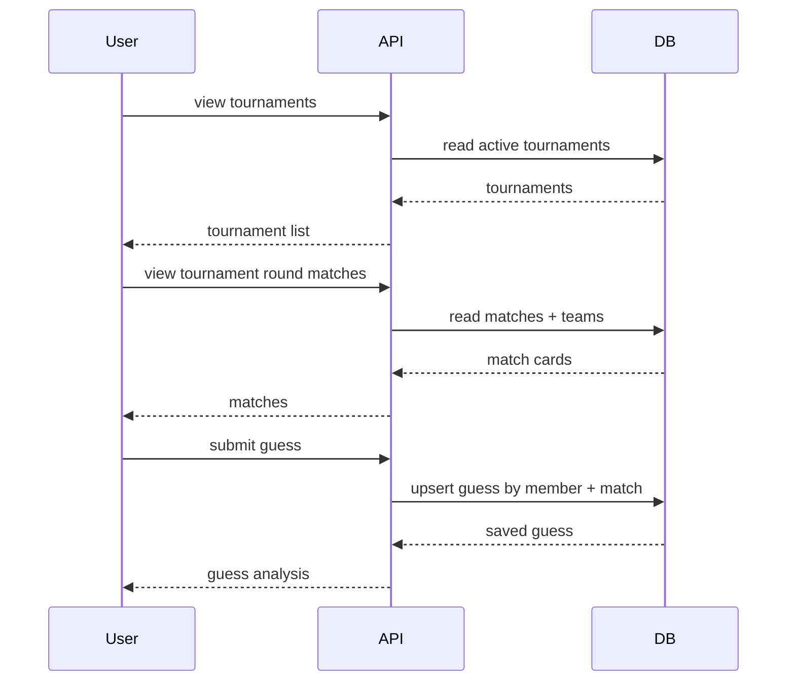
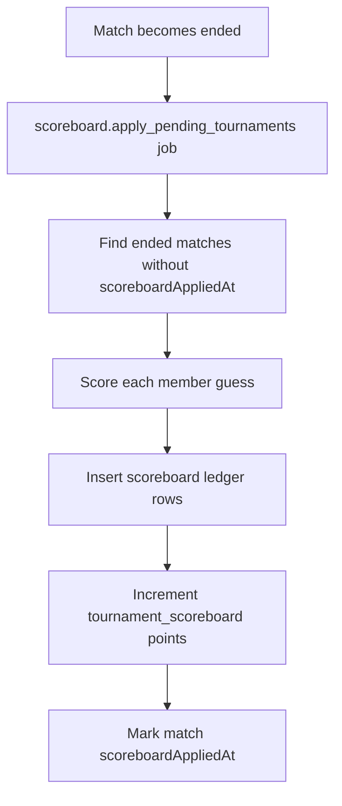
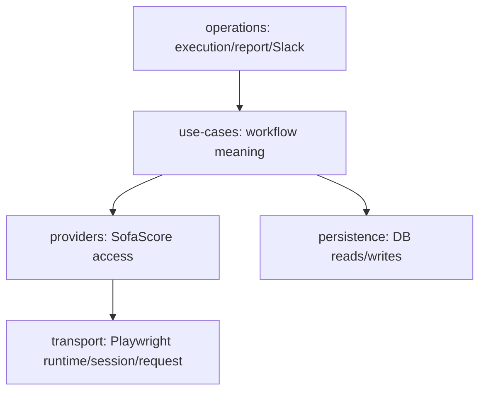
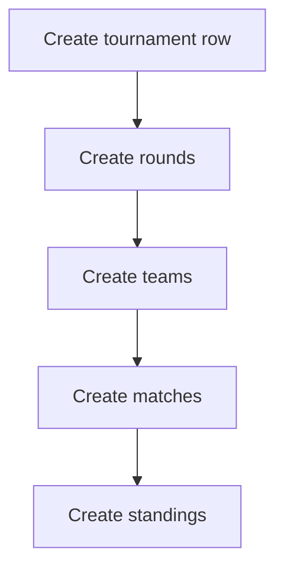
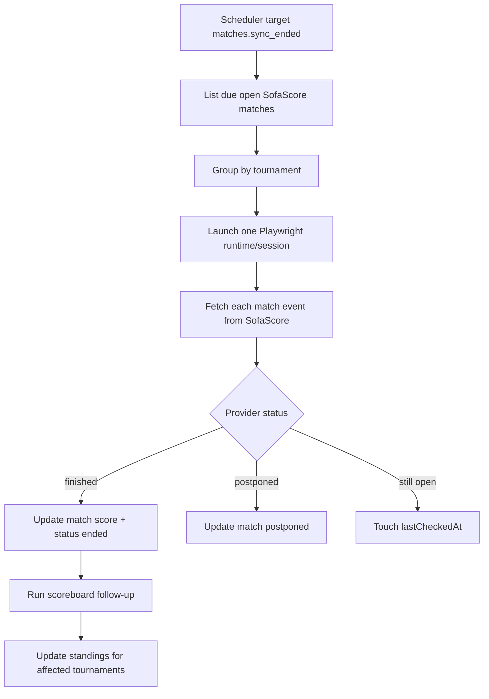

# Legacy Understanding

## Purpose

This document explains what the legacy Best Shot API actually did, without asking a new engineer to understand the project by reading every folder first.

The legacy code is reference material only. New work happens at the root of this repo.

```text
legacy/ = old application, used for understanding
root/   = new application, where v1 work happens
```

The legacy app was a football prediction platform. It stored football data, let members guess match scores, updated matches from SofaScore, and calculated member scoreboards.

## One-Line Product Summary

```text
Members join leagues, view tournaments, guess match scores, and earn points when matches finish.
```

## Main Product Areas

```text
Identity
  members, auth cookies, admin role

Game
  tournaments, rounds, teams, matches, standings, guesses, scoreboards

Provider
  imports and updates football data from SofaScore

Admin
  operator tools to create/update provider-backed tournaments

Scheduler
  background process that runs recurring and one-time jobs from the database

Observability
  execution rows, JSON reports, Slack messages, Sentry logs
```

## Runtime Shape

Legacy had two deployable Node processes.



The API served HTTP requests. The scheduler ran background jobs.

The CI workflows deployed both as separate Railway services:

```text
api-best-shot
api-best-shot-scheduler
```

## Infrastructure Facts

Legacy local development used Docker for infrastructure and Node/Yarn on the host machine.

```text
Local DB:
  Postgres 15
  container name: bestshot_db
  database: bestshot
  host port: 5433

Local Redis:
  container name: bestshot_redis
  host port: 6379
```

Remote database access used Postgres connection strings:

```text
DB_STRING_CONNECTION
DB_STRING_CONNECTION_DEMO
DB_STRING_CONNECTION_STAGING
DB_STRING_CONNECTION_PRODUCTION
```

These are historical legacy names. The new root application does not reuse them; it uses the
canonical name `DATABASE_URL`, scoped by local runtime, GitHub Environment, or Cloudflare Worker.

The legacy migrations lived here:

```text
legacy/supabase/migrations/
```

The legacy Drizzle config generated migrations into that Supabase migrations directory.

Legacy docs explicitly mention the Supabase transaction pooler as the DB connection strategy. So for the reset, Supabase is the known Postgres provider unless we deliberately decide otherwise.

## Legacy Stack

```text
Runtime: Node.js
API: Express
Language: TypeScript
Database: PostgreSQL
ORM/migrations: Drizzle
Provider browser: Playwright / Chromium
Local infra: Docker Compose
Old deploy target: Railway
Reports/assets: AWS S3 + CloudFront
Notifications: Slack
Monitoring: Sentry
Package manager in legacy: Yarn 3
Package manager in new root: pnpm
```

## API Shape

Legacy mounted everything under `/api`.

```text
/api/v1/auth
/api/v2/auth
/api/v1/dashboard
/api/v2/dashboard
/api/v1/guess
/api/v2/guess
/api/v1/leagues
/api/v2/leagues
/api/v1/match
/api/v2/match
/api/v1/member
/api/v2/member
/api/v1/tournaments
/api/v2/tournaments
/api/v2/admin
/api/v2/ai
```

Most product routes required auth. Admin routes required the member role to be `admin`.

Auth used a JWT stored in an HTTP-only cookie. Login used a member `publicId`; admin authorization reloaded the member from the database before checking the role.

## Core Data Model

The central game data model was:



Provider identity was stored on domain rows:

```text
tournament.provider + tournament.externalId
team.provider + team.externalId
match.provider + match.externalId
```

Internal relationships used UUIDs.

## Game Flow

The normal user-facing game flow was:



A member could create or update one guess per match. The unique constraint was:

```text
matchId + memberId
```

## Guess Scoring

Legacy scoring was simple:

```text
correct match outcome: 3 points
exact home score:      0 points
exact away score:      0 points
```

The code still calculated per-team correctness labels, but the configured points for exact score components were zero.

The match outcome was:

```text
HOME_WIN
AWAY_WIN
DRAW
```

Guesses became final only after the match had an ended status.

## Scoreboard Flow

Scoreboard calculation was asynchronous.



The scoreboard ledger prevented duplicate scoring by using:

```text
matchId + memberId + ruleVersion
```

Tournament scoreboard rows stored accumulated points per member per tournament.

League score did not have separate scoring rules. It summed tournament scoreboard points across active tournaments in the league.

## Provider Purpose

The provider system existed because the app depended on external football data.

```text
SofaScore data
  -> tournaments
  -> rounds
  -> teams
  -> matches
  -> standings
  -> match result updates
```

The API should serve our database to users. The provider exists to keep that database filled and fresh.

## Provider Access Strategy

Legacy avoided DOM scraping.

The working approach was browser-based API access:

```text
Open Chromium with Playwright
Navigate to SofaScore API URL
Read JSON rendered in the page body/pre tag
Parse JSON
Map it into our database shape
```

Plain server-side fetch was a known 403 path for tested SofaScore URLs.

## Data Provider V1

V1 used a large `BaseScraper` and large provider services.

It mixed several concerns:

```text
browser lifecycle
SofaScore endpoint access
mapping provider payloads
database writes
asset uploads
operation reports
Slack notifications
```

That made it hard to reason about and was a major reason V2 existed.

## Data Provider V2

V2 was a rewrite with clearer boundaries.



The V2 rule was:

```text
Do not import from V1 data-provider code.
Keep browser-context access for SofaScore.
Keep execution jobs, reports, and Slack as first-class operational requirements.
```

For the reset, V2 should be treated as a reference for lessons, not copied wholesale.

## Tournament Assembly Flow

Creating a fully useful tournament was a dependency chain.



The chain mattered because later steps depended on earlier data:

```text
matches need stored rounds
matches need teams resolved by provider external ID
standings need teams resolved by provider external ID
```

If teams were missing, standings and matches could be blocked.

## Important SofaScore Endpoints

Legacy V2 built these provider URLs:

```text
match event:
  https://www.sofascore.com/api/v1/event/:matchExternalId

tournament standings:
  {tournament.baseUrl}/standings/total

tournament team events:
  {tournament.baseUrl}/team-events/total

tournament rounds:
  {tournament.baseUrl}/rounds

round events:
  stored round.providerUrl
```

Example round event shape:

```text
https://www.sofascore.com/api/v1/unique-tournament/:id/season/:season/events/round/:round
```

## Browser Runtime Model

V2 separated browser lifetime from browser workspace lifetime.

```text
runtime = launched Chromium browser
session = one browser context + one page
```

Single-operation shape:

```text
create runtime
create session
run one tournament operation
close session
close runtime
```

Batch shape:

```text
create runtime once
create one session
run many tournament operations
close session
close runtime
```

Open match sync and standings update used the batch shape.

## Warm-Up Reality

Warm-up was inconsistent.

Some workflows had usable warm-up, others effectively did not.

```text
Usable warm-up:
  tournament_create_v2 asset upload
  teams_create_v2 badge upload
  matches_sync_open_v2

No effective warm-up:
  rounds create/update
  standings create/update
  matches create/update
  current round sync
  knockout rounds sync
```

For `matches_sync_open_v2`, warm-up triggered only when a 403 response body contained `"challenge"`.

If SofaScore returned plain `403 Forbidden`, the V2 code did not warm up or retry.

## Open Match Update Flow

Open match sync was the live freshness loop.



Legacy selected due open matches with these ideas:

```text
status = open
provider = sofascore
date <= now
limit = 30
ordered by latest match date, then oldest lastCheckedAt
```

Important: the query did not enforce a hard "only if lastCheckedAt is older than 2 minutes" condition. The scheduler cadence controlled how often it ran.

## Scheduler Model

The scheduler was a dedicated Node process.

It did not use Redis queues in the implemented legacy path.

It stored job definitions and job runs in Postgres:

```text
cron_job_definitions
cron_job_runs
```

On startup, it:

```text
1. marked pending/running old runs as skipped
2. processed due one-time jobs
3. loaded active recurring definitions
4. registered node-cron tasks
5. periodically swept one-time jobs and synced recurring definitions
```

Registered target IDs included:

```text
matches.sync_open
matches.sync_ended
scoreboard.apply_pending_tournaments
tournaments.current_round_sync
tournaments.knockout_rounds_sync
```

Some targets called V1 provider services. Some called V2 use-cases. Legacy was mixed.

## Execution Records And Reports

Provider operations wrote rows to:

```text
data_provider_executions
```

Scoreboard operations wrote rows to:

```text
scoreboard_executions
scoreboard_ledger
```

Reports were JSON documents uploaded to S3 when configured, with local fallback in some V1 paths.

Slack notifications were used for success/failure or meaningful operational events.

For the reset, these are useful patterns but not required in the first Almanac slice.

## Known Legacy Problems

These are not opinions; they come from the audited code.

```text
1. At audit time, the root reset had a broken health DB import because its database client was
   deleted. The rebuilt application now owns that client at src/platform/database/index.ts.
2. Root package scripts mention sql/schema and sql/seeds files, but sql/ does not exist.
3. Root README says Playwright is not included yet, but package.json currently includes playwright.
4. Legacy match status typing does not match usage: schema typing lists notstarted/in-progress/etc., while logic uses open and not-defined.
5. Legacy provider warm-up was inconsistent across workflows.
6. Legacy provider/admin/scheduler code mixed V1 and V2 paths.
7. V1 provider services mixed too many concerns.
8. Some docs still refer to old Railway/api-best-shot assumptions.
9. A frontend-looking ui-system TSX file exists inside legacy API source.
```

## What To Preserve Conceptually

Do preserve these ideas:

```text
1. API serves our DB, not live provider calls to users.
2. Provider data writes into our own tables.
3. Provider identity stays separate from internal IDs.
4. Tournament assembly is staged.
5. Scoreboard calculation should be idempotent.
6. Background work should have durable run records if it matters operationally.
7. Admin/provider operations need clear errors.
8. Cloud deployment must be validated early when provider access is involved.
```

## What Not To Copy Blindly

Do not blindly copy:

```text
1. Data Provider V2 folder/layer count.
2. Generic operation runners before repetition exists.
3. Slack/report/S3 plumbing for the first Almanac slice.
4. The old cron engine before the new app has real background work.
5. Mixed V1/V2 provider paths.
6. The old Playwright Docker image unless the slice actually needs browser automation.
7. Railway-specific CI commands.
```

## Almanac Implications

Almanac is a new feature, not an existing legacy domain.

The first Almanac slice should not inherit provider ingestion complexity.

For the first slice, the useful proof is:

```text
HTTP request
  -> Node API
  -> Postgres
  -> JSON response
```

Almanac can start read-only and small.

It can reuse the broad legacy stack decision:

```text
Node API
Express unless we deliberately choose NestJS
Postgres
Drizzle migrations
Supabase as the known Postgres provider
Docker only for local Postgres
Cloudflare Containers as the likely deploy target for the Node server
```

It should not start with:

```text
SofaScore provider access
Playwright
scheduler
leaderboard jobs
Slack reports
S3 uploads
cron definitions
```
