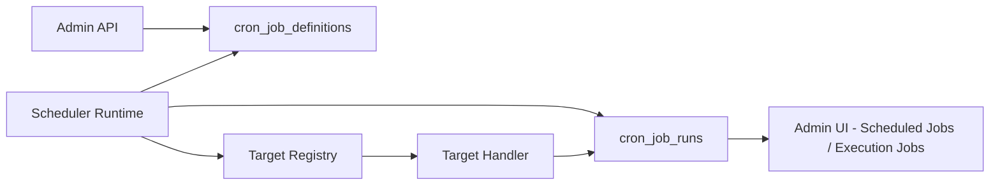
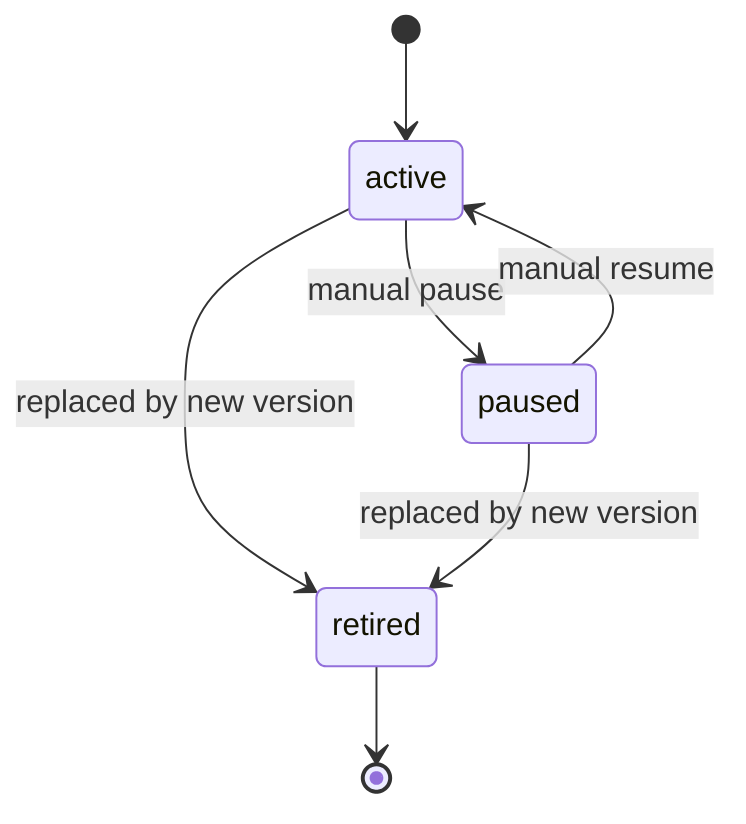
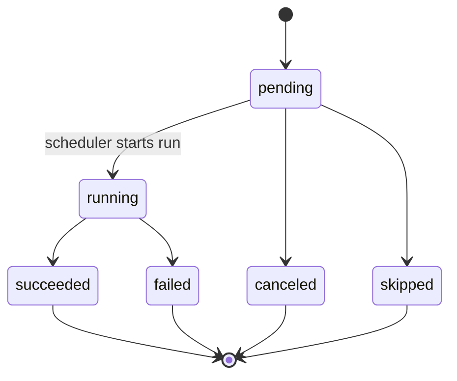

# PDR - Cron Jobs Platform (Cron-Only v1)

Status: Draft  
Date: February 20, 2026  
Owner: Platform / Backend  
Scope: Cron scheduling platform only. Queue design is intentionally out of scope for this document.

Prerequisite reading (fundamentals first):  
`/Users/mariobrusarosco/coding/api-best-shot/docs/plans/cron-jobs-fundamentals.md`

## 1) Why this document exists

We need a reusable Cron Jobs platform that works across the whole app and is not tied to one specific job type.  
This v1 PDR focuses only on cron scheduling, execution tracking, and operational control.

Important scope boundary:
1. This document does not design a queue system.
2. This document keeps cron generic and target-label driven.
3. This document includes readiness hooks for the next PRD: Queue.

## 2) Problem statement

Current backend has no centralized cron runtime or cron domain model.  
Result: scheduling behavior is fragmented and hard to audit, and there is no single source of truth for cron definitions and runs.

We need:
1. One-time jobs.
2. Recurring jobs.
3. Full run history with status and timestamps.
4. Failure diagnostics.
5. Pause failing recurring jobs.
6. Replace with a new version job when needed.

## 3) Goals

1. Create app-wide cron structure and lifecycle.
2. Keep cron engine action-agnostic (target labels only).
3. Persist schedule definitions and run history in PostgreSQL.
4. Expose admin APIs for visibility and control.
5. Support pause, resume, run-now, and new-version workflows.
6. Keep design simple enough to implement safely in staging first.

## 4) Non-goals

1. Defining all business cron targets now.
2. Auto-retry policy.
3. Queue architecture and distributed work fan-out.
4. Rewriting all existing data provider workflows in this phase.

## 5) Current infra snapshot (codebase verified)

### Runtime
1. API entrypoint exists at `/Users/mariobrusarosco/coding/api-best-shot/src/index.ts`.
2. No scheduler runtime folder currently exists (`src/scheduler` missing).
3. `node-cron` is installed in dependencies.

### Data and infra
1. PostgreSQL is primary system of record.
2. Redis exists in docker-compose, but this PDR does not depend on Redis.
3. Existing execution tracking pattern already exists for data provider jobs and can inspire cron run history UI.

### Deployment
1. Staging deployment pipeline exists in `.github/workflows/deploy-staging.yml`.
2. Deploys are branch-driven (`staging` branch).
3. Repository workflows indicate deployment to Railway service `api-best-shot`.

### 5.1) Critical runtime assumption (explicit)

When this document says "app is down", it means:  
the **process that runs cron scheduling** is offline.

For v1 in this PDR, cron runs in the dedicated scheduler process/service.

If that process is down, cron callbacks do not fire during downtime.

## 6) Product requirements (from stakeholder input)

1. Cron system must be available through all app modules.
2. Must support list/history of previous cron runs with:
   - timestamps
   - status (`pending`, `failed`, `succeeded`, etc.)
   - target label
3. Must support one-time cron jobs.
4. Must support recurring cron jobs (example every 5 minutes).
5. Must capture why a run failed.
6. No auto-retry required.
7. Must support stopping recurring failing job and scheduling new version.
8. Cron engine must know only target label and metadata, not business logic internals.

## 7) Core concepts

1. Cron Job Definition: schedule configuration and lifecycle state.
2. Cron Job Run: one concrete execution attempt of a definition.
3. Target: label that maps to an action resolver in code (`calling_my_mom`, `search_for_knockout_rounds`).
4. Version: immutable schedule version used for safe replacement.

## 8) Proposed architecture (Cron-only v1)

### Components
1. Cron Definitions API (admin-protected).
2. Cron Scheduler Runtime (same codebase, deployed as dedicated scheduler process/service).
3. Target Registry (label to handler resolver).
4. Run Recorder (writes run lifecycle data to DB).
5. Admin Read APIs for schedules and run history.

### High-level flow


### Why no queue in v1
1. Keeps first delivery focused and testable.
2. Preserves required product behavior.
3. Avoids mixing two concerns in one PRD.

Tradeoff:
1. Throughput ceiling is lower than queue-based architecture.
2. This is acceptable for cron foundation phase and will be addressed in next Queue PRD.

## 9) Data model

### 9.1 Table: `cron_job_definitions`

Purpose: stores schedule and lifecycle metadata.

Columns:
1. `id` uuid primary key
2. `job_key` text not null
3. `version` integer not null
4. `target` text not null
5. `payload` jsonb null
6. `schedule_type` enum (`one_time`, `recurring`)
7. `cron_expression` text null
8. `run_at` timestamp null
9. `timezone` text not null default `UTC`
10. `status` enum (`active`, `paused`, `retired`)
11. `pause_reason` text null
12. `supersedes_job_id` uuid null
13. `created_by` text or uuid
14. `updated_by` text or uuid
15. `created_at` timestamp not null default now
16. `updated_at` timestamp not null default now

Constraints:
1. Unique `(job_key, version)`.
2. For `recurring`, `cron_expression` is required.
3. For `one_time`, `run_at` is required.

Indexes:
1. `status`
2. `target`
3. `(job_key, version)`
4. `schedule_type`

### 9.2 Table: `cron_job_runs`

Purpose: immutable execution history plus execution state.

Columns:
1. `id` uuid primary key
2. `job_definition_id` uuid not null
3. `job_key` text not null
4. `job_version` integer not null
5. `target` text not null
6. `payload_snapshot` jsonb null
7. `trigger_type` enum (`scheduled`, `manual`, `ad_hoc`)
8. `scheduled_at` timestamp not null
9. `started_at` timestamp null
10. `finished_at` timestamp null
11. `status` enum (`pending`, `running`, `succeeded`, `failed`, `canceled`, `skipped`)
12. `failure_code` text null
13. `failure_message` text null
14. `failure_details` jsonb null
15. `runner_instance_id` text null
16. `created_at` timestamp not null default now
17. `updated_at` timestamp not null default now

Indexes:
1. `(status, scheduled_at)`
2. `job_definition_id`
3. `(job_key, job_version)`
4. `target`
5. `created_at`

### 9.3 V1 decision

No `cron_job_events` table in v1.  
We will keep lifecycle visibility through:
1. `cron_job_definitions` state changes
2. `cron_job_runs` execution history
3. structured application logs

## 10) State models

### 10.1 Definition lifecycle


### 10.2 Run lifecycle


## 11) Scheduling semantics

1. One-time jobs:
   - created with `run_at`
   - executed once
   - run result is terminal status (`succeeded` or `failed`)
   - definition transitions to `retired` after terminal run (internal guard against rerun)
2. Recurring jobs:
   - created with `cron_expression`
   - executed at each due time while `active`
3. Timezone:
   - explicit per definition
   - default `UTC`
4. Overlap policy:
   - default no overlap for same definition version
   - if previous run is still `running`, next window is `skipped` (v1 default)
5. Missing windows policy (explicit v1 decision):
   - v1 does **not** replay windows that were never recorded while scheduler was offline
   - this keeps v1 simple and timer-driven
6. Restart behavior (explicit):
   - pure in-memory cron timers do not replay missed triggers automatically
7. Startup recovery policy (v1):
   - on startup, recover stranded `pending` runs before regular timer flow
   - stale `running` runs are not resumed; they are marked `failed` when `started_at` is older than 15 minutes
   - this is recovery for already-recorded runs, not replay of never-recorded windows

## 12) Orchestration behavior (cron-only)

Default in v1: **Mode A+ (timer-driven with startup recovery)**.

### 12.1 Why this mode

1. Simple to understand and implement.
2. Supports your current ask: recover persisted pending work on restart.
3. Avoids reconciliation complexity in v1.

### 12.2 Startup sequence (hands-on)

When scheduler process starts:
1. Load active job definitions from `cron_job_definitions`.
2. Handle stale in-flight runs:
   - find `cron_job_runs` with `status='running'` and `started_at < now - 15 minutes`
   - mark them `failed` with timeout failure code/message
3. Recover stranded pending runs:
   - load `cron_job_runs` where status is `pending`
4. Execute recovered pending runs first.
5. Register in-memory `node-cron` timers for active recurring definitions.

### 12.3 Timer fire sequence (hands-on)

When a cron timer fires for `sample-heartbeat`:
1. Compute slot time (for example `10:05:00`).
2. Insert run row with:
   - `status = pending`
   - `scheduled_at = slot time`
   - snapshot fields (`job_key`, `job_version`, `target`, `payload_snapshot`)
3. Immediately transition `pending -> running`.
4. Execute target handler.
5. Transition to terminal state:
   - success: `running -> succeeded`
   - failure: `running -> failed` + failure diagnostics

### 12.4 Idempotency for timer mode

Required rule:
1. At most one scheduled run per definition+slot.

Recommended unique key:
1. `(job_definition_id, scheduled_at, trigger_type)` for `trigger_type='scheduled'`.

Insertion behavior:
1. `ON CONFLICT DO NOTHING`.
2. If conflict occurs, skip execution for that slot (already created by same or another instance).

### 12.5 What v1 does not do

If scheduler is offline from `10:00` to `10:16`:
1. v1 will not auto-create never-recorded runs for `10:05`, `10:10`, `10:15`.
2. v1 only recovers runs that already exist in DB as `pending`/recoverable.

This is an explicit product decision for simplicity in v1.

### 12.6 Future enhancement (v2)

Not part of v1.

### 12.7 Pseudocode (illustrative)

```ts
onSchedulerStart():
  defs = loadActiveDefinitions()
  markStaleRunningAsFailed(timeout = 15m)
  recoverableRuns = loadRecoverableRuns() // pending only
  for run in recoverableRuns:
    executeRun(run)
  registerCronTimers(defs)

onTimerFire(def):
  slot = computeCurrentSlot(def)
  inserted = insertScheduledRunIfMissing(def, slot) // ON CONFLICT DO NOTHING
  if (!inserted) return
  run = markRunning(inserted.id)
  try:
    executeTarget(run.target, run.payload_snapshot)
    markSucceeded(run.id)
  catch (err):
    markFailed(run.id, err)
```

## 13) Admin API contract (proposed)

Schedule management:
1. `POST /api/v2/admin/cron/jobs`
2. `GET /api/v2/admin/cron/jobs`
3. `GET /api/v2/admin/cron/jobs/:jobId`
4. `PATCH /api/v2/admin/cron/jobs/:jobId/pause`
5. `PATCH /api/v2/admin/cron/jobs/:jobId/resume`
6. `POST /api/v2/admin/cron/jobs/:jobId/new-version`

Run management:
1. `POST /api/v2/admin/cron/jobs/:jobId/run-now`
2. `GET /api/v2/admin/cron/runs`
3. `GET /api/v2/admin/cron/runs/:runId`

Minimal create recurring payload:
```json
{
  "jobKey": "sample-heartbeat",
  "target": "calling_my_mom",
  "scheduleType": "recurring",
  "cronExpression": "*/5 * * * *",
  "timezone": "UTC",
  "payload": {
    "message": "hello world"
  }
}
```

Minimal create one-time payload:
```json
{
  "jobKey": "single-run-sample",
  "target": "search_for_knockout_rounds",
  "scheduleType": "one_time",
  "runAt": "2026-02-21T15:00:00Z",
  "timezone": "UTC",
  "payload": {}
}
```

## 14) Security and access

1. Mutation endpoints are admin-only.
2. Read endpoints are admin-only unless explicitly expanded later.
3. Scheduler runtime uses internal credentials for protected internal operations if needed.
4. All sensitive errors are logged via structured logger, no token leakage.

## 15) Failure diagnostics and observability

Each failed run must include:
1. `failure_code`
2. `failure_message`
3. `failure_details`
4. `started_at`, `finished_at`, computed duration
5. `runner_instance_id`

Operational signals:
1. Total runs by status.
2. Failure rate per target.
3. Consecutive failures per definition.
4. Next scheduled run visibility.

## 16) UI mapping (aligned with existing execution jobs style)

View A: Scheduled Jobs
1. Job key
2. Version
3. Target
4. Schedule type and expression
5. Status
6. Last run status/time
7. Next run time

View B: Execution Jobs
1. Target
2. Status
3. Scheduled at
4. Started at
5. Finished at
6. Duration
7. Failure reason (if any)

## 17) Definition of Done mapping

Implementation DoD (future coding phase):
1. Create simple recurring cron (`*/5 * * * *`) that prints a message.
2. Merge into `staging`.
3. Deploy to staging.
4. Validate run appears in cron run history endpoints.

PDR DoD (this document):
1. Cron-only architecture defined.
2. Models and lifecycle defined.
3. API surface proposed.
4. Open questions documented.
5. Complexity reduced to v1-only decisions.

### 17.1 Locked decisions already agreed

1. `cron_job_runs` retention target is 180 days.
2. `target` labels are validated against a code-level target registry (v1).
3. `run-now` obeys overlap rule (`skip` if active run exists).
4. Pause action requires mandatory reason text.
5. Cron run history read access is admin-only.

## 18) Open questions (to answer before implementation)

No open questions for cron-only v1 at this stage.

## 19) Risks and mitigations

1. Risk: duplicate runs when scheduler restarts.
   - Mitigation: single active scheduler (or leader lock) + unique slot constraint + idempotent insert.
2. Risk: hidden failures.
   - Mitigation: mandatory failure fields and admin visibility.
3. Risk: schedule confusion due to timezone.
   - Mitigation: explicit timezone persisted per job.
4. Risk: throughput limit in cron-only architecture.
   - Mitigation: keep target logic lightweight and keep cron scope focused.
5. Risk: run history table grows indefinitely.
   - Mitigation: retention policy target set to 180 days and future cleanup maintenance script.

## 20) Implementation coverage (must include all)

Cron v1 is only complete when all of these are delivered:
1. Data model and migrations for `cron_job_definitions` and `cron_job_runs`.
2. Admin API for create/list/pause/resume/new-version/run-now and run history reads.
3. Dedicated scheduler app entrypoint and runtime (`src/scheduler/*`).
4. Startup recovery behavior:
   - stale `running` > 15 minutes -> `failed`
   - execute persisted `pending` runs
5. Timer registration and execution for recurring schedules.
6. Idempotent run creation (`ON CONFLICT DO NOTHING` + unique slot key).
7. Overlap rule enforced (`skip`) for scheduled and run-now paths.
8. Target validation against code-level registry (reject unknown targets).
9. Pause requires mandatory reason text.
10. Access control: cron run history is admin-only.
11. Railway deployment with separate scheduler service/process.
12. Staging verification using the DoD recurring 5-min test job.

Reference execution plan:
`/Users/mariobrusarosco/coding/api-best-shot/docs/plans/cron-jobs-implementation-checklist.md`

---

This PDR is intentionally scoped to cron-only v1.
