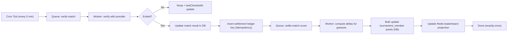

# Queue + Cron + Scoreboard Orchestration Plan

This plan is designed for step-by-step execution with explicit review gates after each task.

## Execution Rules

1. We do not assume Redis/queue/scoreboard works until validated.
2. We do not move to the next task until you review and approve the current one.
3. We prioritize correctness, observability, and replay safety over speed.

# Phase 1

## Goal

Establish ground truth and remove assumptions about current behavior.

## Tasks

### Task 1 - Baseline verification and architecture inventory []
#### Task 1.1 - Run and record compile/test/health checks (compile, tests, API health, Redis ping) []
#### Task 1.2 - Validate Docker/healthcheck route alignment and environment constraints []
#### Task 1.3 - Inventory all queue/cron/scoreboard references in code and docs []
#### Task 1.4 - Produce a short "As-Is Health Report" (green/yellow/red) []

### Task 2 - Baseline acceptance criteria definition []
#### Task 2.1 - Define what "queue working" means (enqueue/dequeue/retry/DLQ) []
#### Task 2.2 - Define what "cron manager working" means (job registry + run history + admin listing) []
#### Task 2.3 - Define what "scoreboard working" means (correct points, idempotent settlement, predictable ranking) []

## Dependencies

1. Access to local DB + Redis.
2. Existing codebase and scripts.

## Expected Result

1. A validated baseline report.
2. Clear success criteria before implementation starts.

## Next Steps

Start Phase 2 after review/approval of Phase 1 outputs.

# Phase 2

## Goal

Define the target architecture contracts before coding behavior.

## Tasks

### Task 1 - Queue and job contract design []
#### Task 1.1 - Define queue names, payload schemas, idempotency keys, retry policy, DLQ policy []
#### Task 1.2 - Define job lifecycle states (queued, in_progress, completed, failed, dead_lettered) []
#### Task 1.3 - Define correlation IDs (`requestId`, `executionId`, `jobId`) []

### Task 2 - Cron manager contract design []
#### Task 2.1 - Define cron registry model (`jobKey`, schedule, enabled, owner, description) []
#### Task 2.2 - Define cron run history model (`startedAt`, `finishedAt`, status, summary, error) []
#### Task 2.3 - Define scheduler heartbeat contract []

### Task 3 - Scoreboard and settlement contract design []
#### Task 3.1 - Define `match_settlement_ledger` model for exactly-once semantics []
#### Task 3.2 - Define scoreboard projection model in Redis and DB fallback rules []
#### Task 3.3 - Define ranking semantics (dense vs ordinal + tie-break policy) []

## Dependencies

1. Phase 1 baseline report.

## Expected Result

1. Approved technical contracts for queue, cron, and settlement.

## Next Steps

Start Phase 3 after contract review/approval.

# Phase 3

## Goal

Implement and validate Queue foundation with no business coupling.

## Tasks

### Task 1 - Queue infrastructure skeleton []
#### Task 1.1 - Create queue service module and typed job contracts []
#### Task 1.2 - Implement enqueue/dequeue primitives backed by Redis []
#### Task 1.3 - Implement retry and DLQ handling []

### Task 2 - Queue observability and diagnostics []
#### Task 2.1 - Add queue stats methods (pending, inflight, dlq) []
#### Task 2.2 - Add structured logging for all queue transitions []
#### Task 2.3 - Add small smoke script to verify queue semantics []

### Task 3 - Queue test coverage []
#### Task 3.1 - Add integration tests for enqueue/dequeue/retry/DLQ []
#### Task 3.2 - Add failure-path tests for malformed payload and Redis interruption []

## Dependencies

1. Phase 2 contracts.

## Expected Result

1. Verified queue behavior independent of cron/business logic.

## Next Steps

Start Phase 4 after queue review/approval.

# Phase 4

## Goal

Build Cron Job Manager with admin visibility.

## Tasks

### Task 1 - Cron registry and scheduler runner []
#### Task 1.1 - Create cron registry in code with canonical job definitions []
#### Task 1.2 - Add scheduler process entrypoint and startup/shutdown handling []
#### Task 1.3 - Add heartbeat key and scheduler liveness checks []

### Task 2 - Cron persistence and run history []
#### Task 2.1 - Create cron run history model/table or persisted log abstraction []
#### Task 2.2 - Persist run start/end/status/error/summary for each execution []
#### Task 2.3 - Add manual run trigger contract []

### Task 3 - Admin endpoints for `/admin/cron` UX []
#### Task 3.1 - Add `GET /api/v2/admin/cron` to list all cron jobs and statuses []
#### Task 3.2 - Add `POST /api/v2/admin/cron/:jobKey/run` for on-demand execution []
#### Task 3.3 - Secure endpoints with admin middleware and add response schema docs []

## Dependencies

1. Phase 3 queue foundation.

## Expected Result

1. Frontend `/admin/cron` can reliably list jobs, status, last run, and scheduler health.

## Next Steps

Start Phase 5 after cron manager review/approval.

# Phase 5

## Goal

Implement Match Update Verifier as a queue-driven worker.

## Tasks

### Task 1 - Match verification job producer []
#### Task 1.1 - Cron enqueues candidate matches for verification every 5 minutes []
#### Task 1.2 - Add dedupe key policy to avoid duplicate verification floods []

### Task 2 - Match verification job consumer []
#### Task 2.1 - Fetch current provider status for each match []
#### Task 2.2 - Detect status transition (`previous != ended && current == ended`) []
#### Task 2.3 - Enqueue scoreboard settlement job only on valid transition []

### Task 3 - Verification run traceability []
#### Task 3.1 - Persist verification execution outcomes []
#### Task 3.2 - Log structured context for each decision (noop, retry, settled) []

## Dependencies

1. Phase 4 cron manager.
2. Existing provider integration.

## Expected Result

1. Deterministic, observable match-ended detection without inline admin coupling.

## Next Steps

Start Phase 6 after verifier review/approval.

# Phase 6

## Goal

Implement settlement and scoreboard models for correctness and scale.

## Tasks

### Task 1 - Settlement data model []
#### Task 1.1 - Add `match_settlement_ledger` table with unique idempotency key []
#### Task 1.2 - Define result hash strategy for replay-safe processing []
#### Task 1.3 - Add migration and query helpers []

### Task 2 - Settlement worker logic []
#### Task 2.1 - Compute per-member point deltas for one ended match []
#### Task 2.2 - Apply bulk updates atomically in Postgres []
#### Task 2.3 - Record ledger status (`applied`/`skipped`/`failed`) []

### Task 3 - Scoreboard projection strategy []
#### Task 3.1 - Update tournament projection in Redis incrementally []
#### Task 3.2 - Update league projections incrementally []
#### Task 3.3 - Add DB fallback and rebuild trigger behavior []

## Dependencies

1. Phase 5 ended-match events.

## Expected Result

1. Exactly-once settlement semantics with projection consistency guarantees.

## Next Steps

Start Phase 7 after settlement review/approval.

# Phase 7

## Goal

Wire end-to-end orchestration and admin visibility.

## Tasks

### Task 1 - End-to-end pipeline integration []
#### Task 1.1 - Connect cron -> queue -> verifier worker -> settlement worker []
#### Task 1.2 - Ensure failures route through retry then DLQ []
#### Task 1.3 - Add operator-level summaries for each run []

### Task 2 - Admin observability endpoints []
#### Task 2.1 - Add queue status endpoint for admin diagnostics []
#### Task 2.2 - Add settlement status endpoint for a match/tournament []
#### Task 2.3 - Add DLQ listing endpoint for operational triage []

## Dependencies

1. Phases 3 to 6 completed.

## Expected Result

1. Full orchestration path is observable and operable from admin APIs.

## Next Steps

Start Phase 8 after E2E review/approval.

# Phase 8

## Goal

Validate scale behavior for 50k users on a high-traffic final match.

## Tasks

### Task 1 - Load scenario creation []
#### Task 1.1 - Seed/simulate 50k users with guesses for one match []
#### Task 1.2 - Prepare replay scenarios and failure injection cases []

### Task 2 - Performance and reliability benchmarking []
#### Task 2.1 - Measure settlement latency (p50/p95/p99) []
#### Task 2.2 - Measure DB update time and Redis projection time []
#### Task 2.3 - Measure queue backlog drain time and retry profile []

### Task 3 - Tuning and acceptance []
#### Task 3.1 - Tune worker concurrency and batch sizes []
#### Task 3.2 - Tune Redis and DB query/index strategy []
#### Task 3.3 - Publish benchmark report with pass/fail criteria []

## Dependencies

1. End-to-end orchestration in place.

## Expected Result

1. Verified capacity envelope and clear scaling limits.

## Next Steps

Start Phase 9 after benchmark review/approval.

# Phase 9

## Goal

Production hardening, runbooks, and rollout readiness.

## Tasks

### Task 1 - Operational hardening []
#### Task 1.1 - Finalize SLOs/alerts for queue, cron, settlement, API []
#### Task 1.2 - Remove or gate debug endpoints and insecure runtime flags []
#### Task 1.3 - Align deployment health checks and startup probes []

### Task 2 - Runbooks and rollback strategy []
#### Task 2.1 - Create DLQ replay runbook []
#### Task 2.2 - Create projection rebuild runbook []
#### Task 2.3 - Create incident triage checklist for scoreboard mismatch []

### Task 3 - Release plan []
#### Task 3.1 - Rollout by feature flags or environment gates []
#### Task 3.2 - Define rollback triggers and rollback actions []
#### Task 3.3 - Capture post-release verification checklist []

## Dependencies

1. Phase 8 validated.

## Expected Result

1. Safe production rollout with clear operator procedures.

## Next Steps

Execute tasks sequentially with review gates and mark each task/subtask status as we progress.

# Simulation

## Cron + Queue + Orchestration Example (Real Match Day)

Pretend the same day has 6 matches across 3 tournaments:

| Match | Tournament | Kickoff |
|---|---|---|
| M1 | T1 | 3:15 PM |
| M2 | T1 | 4:00 PM |
| M3 | T2 | 4:00 PM |
| M4 | T3 | 6:00 PM |
| M5 | T2 | 8:00 PM |
| M6 | T3 | 8:00 PM |

### Visual 1: Clock View (Cron + Queue)

```text
Every 5 min Cron Tick:
3:20, 3:25, 3:30, ... 11:55

At each tick:
1) Find candidate matches (open/in-progress, not checked recently)
2) Enqueue "verify-match" jobs (one per match)
3) Workers process jobs in parallel

If match not ended:
- noop (update lastCheckedAt)

If match ended:
- update DB match result
- enqueue "settle-match-score" job
```

Real moments:

```text
~5:10 PM tick -> M1 now ended -> verify job says "ENDED" -> settlement queued for M1 (T1)
~5:55 PM tick -> M2 + M3 ended -> settlement queued for M2 (T1) and M3 (T2)
~7:55 PM tick -> M4 ended -> settlement queued for M4 (T3)
~9:55 PM tick -> M5 + M6 ended -> settlement queued for M5 (T2) and M6 (T3)
```

### Visual 2: Inside One Ended Match



### How `/admin/cron` Fits

When admin opens `/admin/cron`, backend endpoint returns:

1. Registered cron jobs (`match-verifier-5m`, `knockout-check-daily`, etc).
2. Last run status, duration, next run.
3. Queue stats (`pending`, `processing`, `dlq`).
4. Scheduler heartbeat (`online/offline`).

### Why This Scales for 50k Guesses

For one ended final match with 50k guesses:

1. Only one settlement job for that match.
2. Compute deltas once.
3. Apply points in bulk SQL (not per-user loop).
4. Update Redis sorted sets incrementally.
5. Idempotency key prevents double scoring on retries/replays.

Key design choice: event-driven incremental settlement, not full tournament recalculation on every read.

## Payload Drafts

### 1) `verify-match` Queue Payload

```json
{
  "jobId": "8e2e8c90-8f65-4e58-b2d1-2fdf3b913705",
  "jobType": "verify-match",
  "requestId": "f4d8c6c0-53e5-43c4-9971-2431bf934b90",
  "executionId": "9be539ec-d7fd-4552-944e-5a51959bb8fd",
  "idempotencyKey": "verify:T1:M1:2026-02-18T17:10:00Z",
  "enqueuedAt": "2026-02-18T17:10:00.000Z",
  "attempt": 0,
  "maxAttempts": 3,
  "payload": {
    "matchId": "M1_UUID",
    "tournamentId": "T1_UUID",
    "matchExternalId": "12345",
    "roundSlug": "round-8",
    "provider": "sofascore",
    "scheduledBy": "match-verifier-5m"
  }
}
```

### 2) `settle-match-score` Queue Payload

```json
{
  "jobId": "77193038-3fd6-4b7d-8ec2-3311647e2652",
  "jobType": "settle-match-score",
  "requestId": "f4d8c6c0-53e5-43c4-9971-2431bf934b90",
  "executionId": "9be539ec-d7fd-4552-944e-5a51959bb8fd",
  "idempotencyKey": "settlement:M1_UUID:2026-02-18T17:09:10Z",
  "enqueuedAt": "2026-02-18T17:10:02.000Z",
  "attempt": 0,
  "maxAttempts": 5,
  "payload": {
    "matchId": "M1_UUID",
    "tournamentId": "T1_UUID",
    "finalResult": {
      "homeScore": 2,
      "awayScore": 1,
      "status": "ended",
      "providerFinishedAt": "2026-02-18T17:09:10Z"
    },
    "rankingMode": "dense"
  }
}
```

### 3) `GET /api/v2/admin/cron` Response Payload

```json
{
  "scheduler": {
    "status": "online",
    "heartbeatAt": "2026-02-18T17:10:03.000Z",
    "instanceId": "scheduler-1"
  },
  "jobs": [
    {
      "jobKey": "match-verifier-5m",
      "description": "Verifies candidate matches and emits settlement jobs",
      "schedule": "*/5 * * * *",
      "enabled": true,
      "running": false,
      "lastRun": {
        "startedAt": "2026-02-18T17:10:00.000Z",
        "finishedAt": "2026-02-18T17:10:02.100Z",
        "status": "completed",
        "durationMs": 2100,
        "summary": {
          "candidates": 6,
          "verified": 6,
          "endedDetected": 1,
          "verifyQueued": 6,
          "settlementQueued": 1
        }
      },
      "nextRunAt": "2026-02-18T17:15:00.000Z",
      "queue": {
        "name": "verify-match",
        "pending": 2,
        "processing": 1,
        "dlq": 0
      }
    },
    {
      "jobKey": "knockout-check-daily",
      "description": "Checks tournaments for new knockout rounds",
      "schedule": "0 6 * * *",
      "enabled": true,
      "running": false,
      "lastRun": {
        "startedAt": "2026-02-18T06:00:00.000Z",
        "finishedAt": "2026-02-18T06:00:15.000Z",
        "status": "completed",
        "durationMs": 15000,
        "summary": {
          "tournamentsChecked": 3,
          "newKnockoutRounds": 1
        }
      },
      "nextRunAt": "2026-02-19T06:00:00.000Z",
      "queue": {
        "name": "knockout-rounds-check",
        "pending": 0,
        "processing": 0,
        "dlq": 0
      }
    }
  ]
}
```

### 4) `POST /api/v2/admin/cron/:jobKey/run` Response Payload

```json
{
  "success": true,
  "jobKey": "match-verifier-5m",
  "trigger": "manual",
  "executionId": "61ac59ad-6809-4d1e-a7f6-cd3dd99e9231",
  "queuedAt": "2026-02-18T17:12:00.000Z",
  "message": "Cron job enqueued for immediate execution"
}
```
