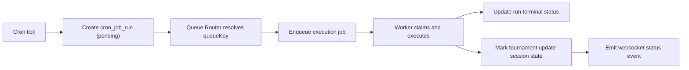
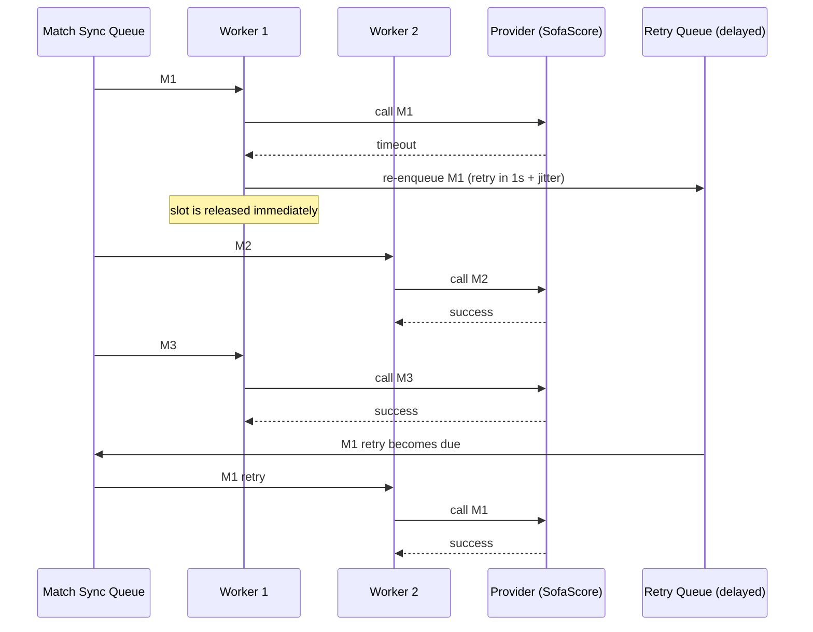

# PDR - Queue Platform v1 (Cron-Integrated, Extensible Queue Catalog)

Status: Draft  
Date: February 25, 2026  
Owner: Platform / Backend  
Scope: Queue architecture for asynchronous execution at scale, integrated with existing cron platform.

Prerequisite reading:  
`/Users/mariobrusarosco/coding/api-best-shot/docs/plans/cron-jobs-pdr.md`

## 1) Why this document exists

The current cron platform is a strong control plane, but at scale it should not execute heavy target logic inline.

We need:
1. Parallel execution for high fan-out workloads (for example 300+ match sync calls).
2. Safe provider call pacing to avoid unknown external API limits.
3. Clear tournament update lifecycle for frontend transparency.
4. An architecture that supports **as many queues as needed**, not a fixed queue count.

## 2) Problem statement

If one cron run discovers hundreds of matches and processes them sequentially:
1. Completion time is too high.
2. Retry handling becomes fragile.
3. Scoreboard recalculation can become noisy and redundant.
4. User experience degrades because progress is opaque.

We need a queue-based execution plane while preserving the existing cron history and run lifecycle.

## 3) Goals

1. Keep cron as control plane (definition + scheduling + run audit).
2. Move heavy execution to worker queues.
3. Support open-ended queue taxonomy (N queues over time).
4. Provide predictable throttling and retries.
5. Expose tournament update state for realtime frontend UX.
6. Keep v1 operational complexity moderate.

## 4) Non-goals (v1)

1. Full dynamic queue auto-provisioning at runtime across infrastructure providers.
2. Multi-region active-active queue execution.
3. Provider-specific adaptive algorithms (AIMD) in first iteration.
4. Exactly-once delivery guarantees (at-least-once + idempotency is sufficient).

## 5) Design principles

1. **Control plane vs execution plane separation**:
   - Cron schedules and records.
   - Queue workers execute.
2. **Fan-out then fan-in**:
   - Fan-out match sync jobs.
   - Fan-in scoreboard recalculation by tournament.
3. **Idempotency first**:
   - Duplicate deliveries are expected; handlers must be safe.
4. **State transitions over raw speed**:
   - Explicit user-facing update status is required.
5. **Open queue catalog**:
   - No hard-coded limit on queue count.

## 6) Architecture options and trade-offs

### Option A - Postgres-only queue

1. Use DB rows as queue + run history.
2. Workers claim with `FOR UPDATE SKIP LOCKED`.

Trade-offs:
1. Pros: no new infrastructure.
2. Cons: DB pressure, weaker delay/retry ergonomics, harder horizontal scaling.

### Option B - Redis queue transport + DB source of truth (Recommended v1)

1. Keep cron tables as source of truth.
2. Push executable jobs to Redis queue(s).
3. Workers process queue jobs and update DB run state.

Trade-offs:
1. Pros: scalable parallelism, better retry/backoff handling, clean separation.
2. Cons: added operational component.

### Option C - Event-stream backbone (Kafka-style)

1. Use stream partitions for execution orchestration.

Trade-offs:
1. Pros: high scalability, strong replay model.
2. Cons: operational complexity too high for current phase.

## 7) Recommended v1 architecture

Choose **Option B** with an extensible queue catalog pattern.

### 7.0 Infrastructure decision (locked)

This section is mandatory architecture contract, not implementation detail.

1. Redis hosting:
   - Use managed Redis on Railway per environment (`staging`, `demo`, `production`).
   - Do not use self-hosted Redis for cloud environments.
2. Service ownership:
   - `api-best-shot-scheduler`: producer/dispatcher only.
   - `api-best-shot-worker` (new Railway service): consumer/executor only.
   - `api-best-shot`: HTTP API + Bull Board (admin-only).
3. BullMQ role:
   - BullMQ is a library running inside services, not a separate hosted platform.
4. Environment contract:
   - Required for all queue participants: `REDIS_URL`, `QUEUE_PREFIX`.
   - Required for scheduler/worker: queue tuning vars (concurrency, retries, backoff).
5. Security contract:
   - Bull Board must be protected by admin authentication.
   - Bull Board should be exposed only through protected/private access.
6. Failure contract:
   - If Redis is unavailable, queue operations fail fast and run state is recorded as failed.
   - No silent job drops are allowed.
   - PostgreSQL remains source of truth for cron run state/history.

### 7.1 Core components

1. **Cron Scheduler**:
   - Finds due work and creates `cron_job_runs`.
2. **Queue Router**:
   - Maps cron target or domain action to queue key.
3. **Queue Broker**:
   - Enqueues jobs by queue key.
4. **Worker Pools**:
   - One or more pools per queue key.
5. **Provider Gateway**:
   - Enforces fixed provider pacing (v1).
6. **Tournament Update Session Store**:
   - Tracks tournament update lifecycle.
7. **Realtime Event Publisher**:
   - Emits WebSocket events on status transitions.

### 7.2 Queue count strategy (critical requirement)

The system is designed for **unbounded logical queue keys**:
1. `match.sync.sofascore`
2. `tournament.recalc`
3. `notification.realtime`
4. `maintenance.cleanup`
5. `...` (new queues can be added without architecture changes)

No fixed maximum queue number is assumed in architecture.

## 8) Queue catalog model

Define queue behavior through a catalog/registry contract (config-driven in v1, DB-driven optional v2).

Required fields per queue:
1. `queueKey` (unique logical name)
2. `queueType` (`provider_bound`, `compute_bound`, `io_bound`, `notification`)
3. `concurrency`
4. `retryPolicy` (`maxAttempts`, `backoffBaseMs`, `maxBackoffMs`, `jitter`)
5. `rateLimitPolicy` (optional by provider)
6. `deadLetterEnabled`
7. `enabled`

Result:
1. New queues are added by new catalog entries + worker binding.
2. Existing queues can be tuned without redesign.

## 9) Cron integration contract

### 9.1 High-level flow

### 9.2 Run semantics

1. Cron keeps current lifecycle (`pending -> running -> succeeded/failed/skipped`).
2. Queue job payload includes `runId` and correlation metadata.
3. Worker executes using run claim semantics so duplicate deliveries are safe.

## 10) Tournament update lifecycle (user-facing)

State machine:
1. `idle`
2. `syncing_matches`
3. `recalculating_scoreboard`
4. `completed`
5. `failed`

Realtime events:
1. `tournament_update_started`
2. `tournament_update_progress` (optional in v1)
3. `tournament_update_completed`
4. `tournament_update_failed`

API contract additions:
1. `updateStatus`
2. `freshAsOf`
3. `updateStartedAt`
4. `lastProgressAt`
5. `pendingJobs` (optional)

## 11) Rate limiting and retries (middle-ground v1)

Given unknown SofaScore rate limits:

1. Fixed global provider cap (start conservative).
2. Modest worker concurrency.
3. Exponential backoff with jitter for retries.
4. Optional simple safety brake:
   - if consecutive provider failures exceed threshold, pause provider-bound queue briefly.

This avoids adaptive-control complexity while remaining safer than unbounded parallel calls.

### 11.1 Retry policy (locked v1 baseline)

1. Maximum attempts: `3` total (first attempt + up to 2 retries).
2. Backoff schedule: `1s`, then `2s`.
3. Retry only transient failures:
   - network/connectivity errors
   - timeouts
   - HTTP 5xx
4. Do not retry permanent failures (for example malformed payload/domain validation failures).

### 11.2 Jitter definition (plain language)

`Jitter` means adding a small random delay to retry wait time so many failed jobs do not retry at the exact same moment.

v1 default:
1. Optional random delay range: `0-300ms`.

### 11.3 Non-blocking retry behavior

Retries must be delayed/re-enqueued, not held inline on a worker slot.

Required effect:
1. While one match is waiting for retry backoff, workers continue processing other pending matches.
2. Retry workload forms a small tail and does not block first-pass throughput.

### 11.4 Retry sequence (example)

## 12) Workload shaping rule

### 12.1 Fan-out

1. One sync job per match for provider fetch/update.

### 12.2 Fan-in

1. Recalculate scoreboard once per tournament per debounce window.
2. Never trigger one recalc per match update.

This is the key scaling control for tournament-heavy workloads.

## 13) Capacity model (planning formula)

For a batch of `M` match calls and provider rate budget `R` req/sec:

1. First-pass lower-bound completion time ~= `M / R` seconds.
2. Real completion time = first-pass + retry overhead.

Example:
1. `M = 300`
2. `R = 3 req/sec`
3. First pass ~= 100 seconds (plus retries/backoff)

This contract should guide cron cadence and UI messaging.

## 14) Observability requirements

Minimum metrics:
1. Queue depth by `queueKey`
2. Oldest job age by `queueKey`
3. Throughput by `queueKey`
4. Retry count and failure reasons
5. Provider error rate/latency
6. Tournament state durations (`syncing`, `recalculating`)

Minimum logs:
1. Correlation keys (`runId`, `queueJobId`, `tournamentId`)
2. Queue transitions
3. Retry and DLQ transitions

## 15) Failure and recovery model

1. Delivery semantics: at-least-once.
2. Handler semantics: idempotent.
3. After max attempts:
   - mark failed,
   - push to dead-letter queue (if enabled),
   - emit tournament failure status if user-facing flow is impacted.
4. Recovery:
   - re-drive DLQ job manually or by controlled batch replay.

## 16) Security and access

1. Queue mutation/orchestration remains internal to backend services.
2. Admin APIs expose status/history only.
3. Realtime channels must enforce authorization by tournament/member scope.

## 17) Rollout phases

### Phase 1 - Queue foundation

1. Add queue router + one provider-bound queue for match sync.
2. Keep cron history as source of truth.
3. Worker processes run payloads via existing cron run lifecycle.

### Phase 2 - Tournament lifecycle + fan-in recalc

1. Add tournament update session state machine.
2. Add recalc debounce queue by tournament.
3. Emit start/completed/failed states.

### Phase 3 - Realtime UX

1. Publish websocket events on tournament status transitions.
2. Frontend reacts without manual refresh.
3. Keep polling fallback for resilience.

## 18) Open questions

1. Should queue catalog be config-file based in v1 or DB-managed from day one?
2. What are initial default caps for provider-bound queues per environment?
3. Should tournament update sessions be persisted in Postgres, Redis, or both?
4. What is the initial DLQ replay policy for production incidents?

## 19) Definition of Done (architecture phase)

1. Queue platform architecture approved.
2. Cron integration contract approved.
3. Tournament lifecycle + realtime event contract approved.
4. Extensible queue catalog requirement approved (no fixed queue count).
5. Rollout phases agreed before implementation planning.
